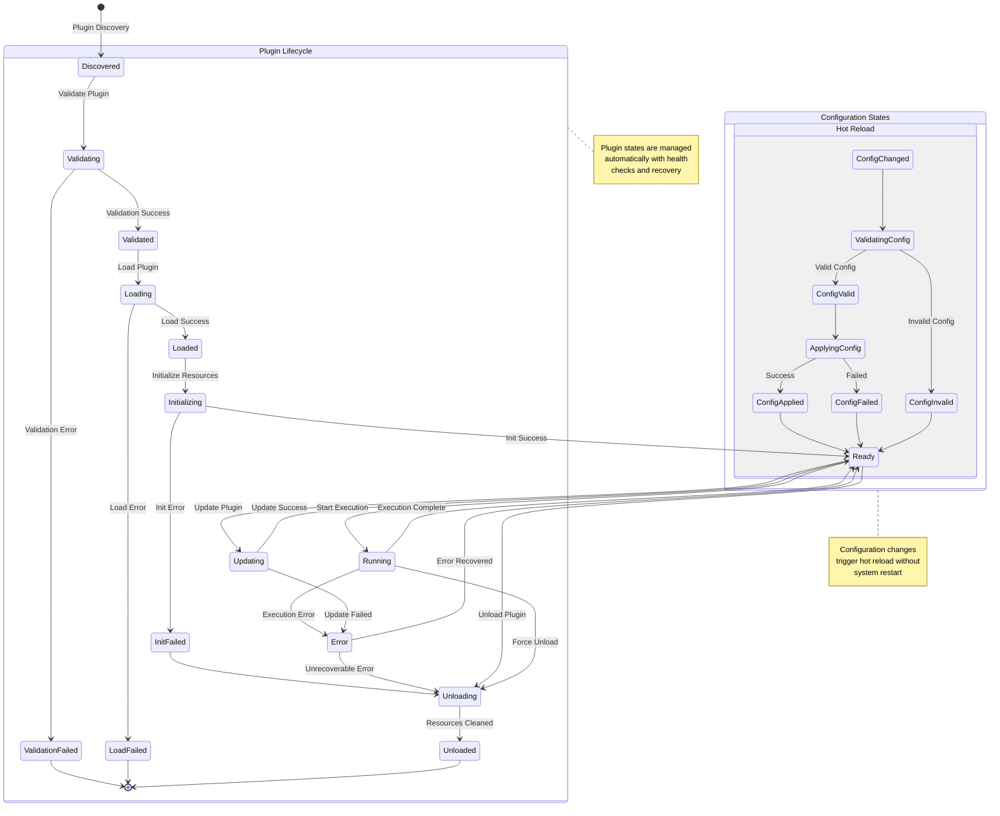

# Release Risk Analyzer - Modular Agentic Architecture

## Overview

This document outlines the comprehensive architecture for a sophisticated **Release Risk Analyzer** using a **plugin-based agent framework** with **LangGraph** orchestration and **Pydantic** data validation. The system implements a **highly configurable multi-agent workflow** that enables easy addition of new agents through a standardized plugin architecture with **LLM-first intelligence** and **reliable heuristic fallback** mechanisms.

## 🏗️ Architecture Principles

### Core Design Patterns
- **Plugin-Based Agent Framework**: Standardized interface for easy agent addition and removal
- **Configuration-Driven Workflow**: YAML/JSON configuration defines agent pipelines and dependencies
- **State-Driven Workflow**: LangGraph manages complex state transitions between configurable agents
- **Type-Safe Data Flow**: Pydantic models ensure schema validation at every step
- **LLM-First Intelligence**: Primary analysis using large language models with semantic understanding
- **Conditional Routing**: Dynamic decision making based on analysis results and confidence levels
- **Fallback Strategies**: Graceful degradation from LLM to heuristic analysis
- **Hot-Swappable Agents**: Runtime agent addition/removal without system restart
- **Dependency Injection**: Agents receive required services through standardized injection

### Key Technologies
- **LangGraph**: Agent orchestration and workflow management
- **Pydantic**: Data validation and structured output
- **LangChain**: LLM integration and prompt management
- **OpenAI/Anthropic**: Large language model providers
- **FastAPI**: REST API for integration
- **Asyncio**: Concurrent processing where possible
- **Plugin Framework**: Custom plugin system for agent management
- **Configuration Management**: YAML-based configuration with hot-reload

## 🔌 Plugin-Based Agent Framework

### Agent Plugin Interface

```python
from abc import ABC, abstractmethod
from typing import Dict, Any, Optional, List
from pydantic import BaseModel, Field
from enum import Enum

class AgentCapability(Enum):
    """Defines what capabilities an agent provides"""
    ANALYSIS = "analysis"
    VALIDATION = "validation"
    DECISION = "decision"
    ENRICHMENT = "enrichment"
    NOTIFICATION = "notification"
    MONITORING = "monitoring"

class AgentMetadata(BaseModel):
    """Metadata describing the agent plugin"""
    name: str
    version: str
    description: str
    author: str
    capabilities: List[AgentCapability]
    dependencies: List[str] = []
    execution_priority: int = 50  # 1-100, lower = higher priority
    parallel_compatible: bool = True
    required_config: Dict[str, Any] = {}

class AgentInput(BaseModel):
    """Standardized input interface for all agents"""
    data: Dict[str, Any]
    context: Dict[str, Any] = {}
    config: Dict[str, Any] = {}

class AgentOutput(BaseModel):
    """Standardized output interface for all agents"""
    result: Dict[str, Any]
    metadata: Dict[str, Any] = {}
    confidence: float = Field(ge=0.0, le=1.0, default=1.0)
    analysis_method: str = "unknown"
    execution_time: Optional[float] = None
    errors: List[str] = []

class BaseAgentPlugin(ABC):
    """Base class for all agent plugins"""
    
    def __init__(self, config: Dict[str, Any]):
        self.config = config
        self.metadata = self.get_metadata()
        self.validate_config()
    
    @abstractmethod
    def get_metadata(self) -> AgentMetadata:
        """Return agent metadata"""
        pass
    
    @abstractmethod
    async def process(self, input_data: AgentInput, state: 'RiskAnalysisState') -> AgentOutput:
        """Main processing method for the agent"""
        pass
    
    @abstractmethod
    def validate_config(self) -> None:
        """Validate agent configuration"""
        pass
    
    async def health_check(self) -> bool:
        """Health check for the agent"""
        return True
    
    async def initialize(self) -> None:
        """Initialize agent resources"""
        pass
    
    async def cleanup(self) -> None:
        """Cleanup agent resources"""
        pass
```

### Plugin Registry System

```python
class AgentPluginRegistry:
    """Registry for managing agent plugins"""
    
    def __init__(self):
        self.agents: Dict[str, BaseAgentPlugin] = {}
        self.metadata: Dict[str, AgentMetadata] = {}
        self.execution_order: List[str] = []
        
    def register_agent(self, agent: BaseAgentPlugin) -> None:
        """Register a new agent plugin"""
        metadata = agent.get_metadata()
        
        # Validate dependencies
        self._validate_dependencies(metadata)
        
        # Register agent
        self.agents[metadata.name] = agent
        self.metadata[metadata.name] = metadata
        
        # Update execution order
        self._update_execution_order()
        
    def unregister_agent(self, agent_name: str) -> None:
        """Unregister an agent plugin"""
        if agent_name in self.agents:
            del self.agents[agent_name]
            del self.metadata[agent_name]
            self._update_execution_order()
    
    def get_agent(self, agent_name: str) -> Optional[BaseAgentPlugin]:
        """Get agent by name"""
        return self.agents.get(agent_name)
    
    def get_execution_order(self) -> List[str]:
        """Get agents in execution order"""
        return self.execution_order.copy()
    
    def _validate_dependencies(self, metadata: AgentMetadata) -> None:
        """Validate agent dependencies are satisfied"""
        for dep in metadata.dependencies:
            if dep not in self.agents:
                raise ValueError(f"Dependency '{dep}' not found for agent '{metadata.name}'")
    
    def _update_execution_order(self) -> None:
        """Update execution order based on dependencies and priorities"""
        # Topological sort with priority consideration
        self.execution_order = self._topological_sort_with_priority()
    
    def _topological_sort_with_priority(self) -> List[str]:
        """Topological sort considering dependencies and execution priority"""
        in_degree = {name: 0 for name in self.agents}
        graph = {name: [] for name in self.agents}
        
        # Build dependency graph
        for name, metadata in self.metadata.items():
            for dep in metadata.dependencies:
                if dep in graph:
                    graph[dep].append(name)
                    in_degree[name] += 1
        
        # Priority queue with execution priority
        from heapq import heappush, heappop
        queue = []
        for name in self.agents:
            if in_degree[name] == 0:
                heappush(queue, (self.metadata[name].execution_priority, name))
        
        result = []
        while queue:
            priority, node = heappop(queue)
            result.append(node)
            
            for neighbor in graph[node]:
                in_degree[neighbor] -= 1
                if in_degree[neighbor] == 0:
                    heappush(queue, (self.metadata[neighbor].execution_priority, neighbor))
        
        return result
```

### Configuration-Driven Workflow

```yaml
# workflow_config.yaml
workflow:
  name: "release_risk_analysis"
  version: "2.0.0"
  description: "Configurable release risk analysis workflow"
  
agents:
  # Core Analysis Agents
  - name: "change_log_summarizer"
    enabled: true
    config:
      llm_provider: "openai"
      fallback_provider: "anthropic"
      confidence_threshold: 0.7
      analysis_depth: "detailed"
    
  - name: "policy_validator"
    enabled: true
    depends_on: ["change_log_summarizer"]
    config:
      policy_rules_path: "config/policies.yaml"
      severity_weights:
        critical: 100
        high: 75
        medium: 50
        low: 25
    
  - name: "release_decision_agent"
    enabled: true
    depends_on: ["change_log_summarizer", "policy_validator"]
    config:
      decision_thresholds:
        auto_approve: 25
        conditional_approve: 75
        auto_reject: 100
  
  # Optional Enhancement Agents
  - name: "security_analyzer"
    enabled: true
    depends_on: ["change_log_summarizer"]
    parallel: true
    config:
      scan_types: ["secret_detection", "vulnerability_scan", "dependency_check"]
      
  - name: "performance_analyzer" 
    enabled: false
    depends_on: ["change_log_summarizer"]
    parallel: true
    config:
      metrics: ["complexity", "performance_impact", "resource_usage"]
      
  - name: "compliance_checker"
    enabled: true
    depends_on: ["policy_validator"]
    config:
      standards: ["SOX", "GDPR", "HIPAA"]
      
  - name: "notification_agent"
    enabled: true
    depends_on: ["release_decision_agent"]
    config:
      channels: ["slack", "email", "webhook"]
      templates_path: "config/notifications/"

execution:
  mode: "sequential_with_parallel"  # sequential, parallel, hybrid
  timeout_seconds: 300
  retry_attempts: 3
  fallback_strategy: "graceful_degradation"
  
llm_config:
  primary_provider: "openai"
  fallback_provider: "anthropic"
  timeout_seconds: 30
  max_retries: 2
  
monitoring:
  metrics_enabled: true
  tracing_enabled: true
  log_level: "INFO"
```

## 📊 Modular System Architecture Overview

### Plugin-Based Architecture Diagram


### Plugin Lifecycle Management


        end
        
        subgraph "Intelligence Layer"
            LLM1[Primary LLM<br/>OpenAI GPT-4]
            LLM2[Fallback LLM<br/>Anthropic Claude]
            HEUR[Heuristic Engine]
        end
    end
    
    subgraph "Data & State Management"
        STATE[State Manager]
        CACHE[Redis Cache]
        DB[(Analytics DB)]
        AUDIT[(Audit Store)]
    end
    
    subgraph "Infrastructure Layer"
        PROM[Prometheus]
        GRAF[Grafana]
        ALERT[AlertManager]
        LOG[Centralized Logging]
    end
    
    %% External Connections
    GH -->|PR Events| API
    CI -->|Build Context| API
    JIRA -->|Ticket Data| API
    
    %% API Layer Flow
    API --> AUTH
    AUTH --> LB
    LB --> ORCH
    
    %% Agent Orchestration
    ORCH -->|Sequential Flow| SUMM
    SUMM -->|State Transfer| VALID
    VALID -->|State Transfer| DECIDE
    
    %% Intelligence Integration
    SUMM -.->|Primary| LLM1
    SUMM -.->|Fallback| LLM2
    SUMM -.->|Backup| HEUR
    
    VALID -.->|Primary| LLM1
    VALID -.->|Fallback| LLM2
    VALID -.->|Backup| HEUR
    
    DECIDE -.->|Primary| LLM1
    DECIDE -.->|Fallback| LLM2
    DECIDE -.->|Backup| HEUR
    
    %% State Management
    ORCH <--> STATE
    STATE <--> CACHE
    STATE --> DB
    STATE --> AUDIT
    
    %% Monitoring & Observability
    ORCH --> PROM
    SUMM --> PROM
    VALID --> PROM
    DECIDE --> PROM
    
    PROM --> GRAF
    PROM --> ALERT
    ALERT --> SLACK
    
    %% Response Flow
    DECIDE -->|Results| API
    API --> GH
    API --> CI
    API --> SLACK
    
    %% Styling
    classDef agentBox fill:#e1f5fe,stroke:#01579b,stroke-width:2px
    classDef llmBox fill:#f3e5f5,stroke:#4a148c,stroke-width:2px
    classDef dataBox fill:#e8f5e8,stroke:#1b5e20,stroke-width:2px
    classDef infraBox fill:#fff3e0,stroke:#e65100,stroke-width:2px
    
    class SUMM,VALID,DECIDE agentBox
    class LLM1,LLM2,HEUR llmBox
    class STATE,CACHE,DB,AUDIT dataBox
    class PROM,GRAF,ALERT,LOG infraBox
```

### Agent-Level Architecture Diagram


## 🔄 Communication Flow Diagrams

### Sequential Processing Flow


### LLM Integration & Fallback Flow


### State Management Flow


### Data Flow Architecture


## 🤖 Detailed Agent Functional Specifications

### 1. Change Log Summarizer Agent 🔍

**Primary Function**: Intelligent analysis and summarization of pull request changes with semantic understanding

#### Core Responsibilities:
- **Semantic Analysis**: Deep understanding of change intent and context using LLM
- **Pattern Recognition**: Identification of change patterns, risk indicators, and code complexity
- **Impact Assessment**: Evaluation of change scope and potential system impact
- **Module Classification**: Intelligent categorization of affected system components

#### LLM Analysis Capabilities:
```python
async def analyze_with_llm(self, pr_data: PRInput) -> ChangeLogSummary:
    """LLM-powered semantic analysis of PR changes"""
    prompt = f"""
    Analyze this pull request for semantic understanding:
    
    Title: {pr_data.title}
    Description: {pr_data.body}
    Files Changed: {pr_data.changed_files}
    Stats: +{pr_data.additions}/-{pr_data.deletions}
    
    Provide structured analysis focusing on:
    1. Change intent and business context
    2. Technical complexity assessment  
    3. Risk indicators and potential issues
    4. Affected system components
    5. Confidence level (0.0-1.0)
    """
    
    llm_response = await self.llm_client.analyze(prompt)
    return self.parse_llm_response(llm_response)
```

#### Heuristic Fallback Logic:
- **File Pattern Analysis**: Classification based on file extensions and paths
- **Size-Based Assessment**: Risk scoring based on lines changed and file count
- **Keyword Detection**: Pattern matching for known risk indicators
- **Module Mapping**: Directory structure analysis for component identification

#### Output Schema:
```python
class ChangeLogSummary(BaseModel):
    summary: str
    affected_modules: List[str]
    change_size: Literal["small", "medium", "large"]
    risk_indicators: List[str]
    analysis_method: Literal["llm_primary", "llm_fallback", "heuristic"]
    confidence: float = Field(ge=0.0, le=1.0)
```

### 2. Policy Validator Agent ✅

**Primary Function**: Intelligent policy compliance analysis with contextual understanding

#### Core Responsibilities:
- **Compliance Analysis**: Smart interpretation of organizational policies beyond rule matching
- **Context-Aware Validation**: Understanding policy intent rather than just literal interpretation
- **Violation Detection**: Intelligent identification of policy breaches with severity assessment
- **Reviewer Assignment**: Smart recommendation of required reviewers based on change context

#### LLM Analysis Capabilities:
```python
async def validate_with_llm(self, change_summary: ChangeLogSummary, 
                           policies: PolicyConfig) -> PolicyValidation:
    """LLM-powered policy compliance analysis"""
    prompt = f"""
    Analyze this change for policy compliance:
    
    Change Summary: {change_summary.summary}
    Affected Modules: {change_summary.affected_modules}
    Risk Indicators: {change_summary.risk_indicators}
    
    Organizational Policies:
    - Test Coverage: {policies.require_tests}
    - Security Review: {policies.security_review_threshold}
    - Architecture Review: {policies.architecture_review_modules}
    
    Assess:
    1. Policy compliance and violations
    2. Required approvals and reviewers
    3. Risk assessment with reasoning
    4. Confidence in analysis (0.0-1.0)
    """
    
    llm_response = await self.llm_client.analyze(prompt)
    return self.parse_compliance_response(llm_response)
```

#### Heuristic Fallback Logic:
- **Rule-Based Validation**: Traditional pattern matching for known violations
- **Threshold Checking**: Quantitative assessment against defined limits
- **File Type Analysis**: Extension-based policy application
- **Directory-Based Rules**: Module-specific policy enforcement

#### Output Schema:
```python
class PolicyValidation(BaseModel):
    compliant: bool
    violations: List[PolicyViolation]
    required_reviewers: List[str]
    risk_score: int = Field(ge=0, le=100)
    analysis_method: Literal["llm_primary", "llm_fallback", "heuristic"]
    confidence: float = Field(ge=0.0, le=1.0)

class PolicyViolation(BaseModel):
    type: str
    severity: Literal["low", "medium", "high", "critical"]
    description: str
    affected_files: List[str]
```

### 3. Release Decision Agent 🎯

**Primary Function**: Strategic release decision making with holistic risk-benefit analysis

#### Core Responsibilities:
- **Strategic Analysis**: Comprehensive evaluation considering business impact and technical risk
- **Decision Reasoning**: Detailed rationale for approval/rejection decisions
- **Condition Setting**: Specification of requirements for conditional approvals
- **Stakeholder Impact**: Assessment of broader organizational implications

#### LLM Analysis Capabilities:
```python
async def decide_with_llm(self, change_summary: ChangeLogSummary,
                         policy_validation: PolicyValidation) -> ReleaseDecision:
    """LLM-powered strategic release decision"""
    prompt = f"""
    Make a strategic release decision based on:
    
    Change Analysis:
    - Summary: {change_summary.summary}
    - Size: {change_summary.change_size}
    - Risk Indicators: {change_summary.risk_indicators}
    
    Policy Assessment:
    - Compliant: {policy_validation.compliant}
    - Violations: {policy_validation.violations}
    - Risk Score: {policy_validation.risk_score}
    
    Provide strategic decision considering:
    1. Business value vs. technical risk
    2. Stakeholder impact and timing
    3. Required conditions for approval
    4. Monitoring and rollback requirements
    5. Confidence in decision (0.0-1.0)
    """
    
    llm_response = await self.llm_client.analyze(prompt)
    return self.parse_decision_response(llm_response)
```

#### Heuristic Fallback Logic:
- **Score-Based Thresholds**: Quantitative decision based on risk scores
- **Rule-Based Gates**: Binary approval based on policy compliance
- **Risk Factor Weighting**: Mathematical assessment of cumulative risk
- **Conditional Logic**: Predetermined approval conditions

#### Output Schema:
```python
class ReleaseDecision(BaseModel):
    approved: bool
    decision_type: Literal["approve", "conditional", "reject"]
    rationale: str
    conditions: List[str] = []
    required_actions: List[str] = []
    monitoring_requirements: List[str] = []
    analysis_method: Literal["llm_primary", "llm_fallback", "heuristic"]
    confidence: float = Field(ge=0.0, le=1.0)
```

## 🏗️ Agent Architecture & Communication Flow

### System Architecture Overview


### Agent Communication Protocol

#### 1. Sequential Processing Pipeline
```python
class WorkflowOrchestrator:
    async def execute_analysis_workflow(self, pr_input: PRInput) -> RiskAnalysisState:
        # Initialize shared state
        state = RiskAnalysisState(
            pr_input=pr_input,
            analysis_mode=AnalysisMode.LLM_FIRST,
            confidence_threshold=0.7
        )
        
        # Sequential agent execution with state passing
        state = await self.summarizer_agent.process(state)
        state = await self.validator_agent.process(state)
        state = await self.decision_agent.process(state)
        
        return state
```

#### 2. Inter-Agent Data Flow
- **State Propagation**: Each agent receives complete state from previous agent
- **Incremental Enhancement**: Agents add their analysis to cumulative state
- **Confidence Tracking**: Method selection based on cumulative confidence
- **Error Recovery**: Fallback activation when confidence drops below threshold

#### 3. Conditional Routing Logic
```python
async def route_analysis_method(self, agent: BaseAgent, state: RiskAnalysisState) -> str:
    """Dynamic routing based on confidence and analysis mode"""
    if state.analysis_mode == AnalysisMode.HEURISTIC_ONLY:
        return "heuristic"
    
    if state.analysis_mode == AnalysisMode.LLM_FIRST:
        # Try LLM first, fallback if needed
        llm_result = await agent.analyze_with_llm(state)
        if llm_result.confidence >= state.confidence_threshold:
            return "llm_primary"
        else:
            return "llm_fallback"
    
    if state.analysis_mode == AnalysisMode.HYBRID:
        # Parallel processing with confidence weighting
        return "hybrid"
```

## 🗄️ State Management & Memory Architecture

### Shared State Schema
```python
class RiskAnalysisState(BaseModel):
    # Input data
    pr_input: PRInput
    
    # Analysis configuration
    analysis_mode: AnalysisMode
    confidence_threshold: float = 0.7
    timeout_seconds: int = 30
    
    # Agent outputs
    change_summary: Optional[ChangeLogSummary] = None
    policy_validation: Optional[PolicyValidation] = None
    release_decision: Optional[ReleaseDecision] = None
    
    # State tracking
    current_agent: Optional[str] = None
    processing_start_time: Optional[datetime] = None
    analysis_methods_used: List[str] = []
    confidence_levels: Dict[str, float] = {}
    
    # Error handling
    errors: List[str] = []
    fallback_reasons: List[str] = []
```

### Memory Management Strategy

#### 1. State Persistence
```python
class StateManager:
    def __init__(self):
        self.state_store: Dict[str, RiskAnalysisState] = {}
        self.analysis_history: List[AnalysisRecord] = []
    
    async def persist_state(self, session_id: str, state: RiskAnalysisState):
        """Persist current analysis state"""
        self.state_store[session_id] = state
        await self.save_to_storage(session_id, state)
    
    async def retrieve_state(self, session_id: str) -> Optional[RiskAnalysisState]:
        """Retrieve analysis state for continuation"""
        return self.state_store.get(session_id)
```

#### 2. Analysis Caching
```python
class AnalysisCache:
    def __init__(self):
        self.llm_cache: Dict[str, Any] = {}
        self.heuristic_cache: Dict[str, Any] = {}
    
    async def cache_llm_result(self, input_hash: str, result: Any):
        """Cache LLM results to avoid redundant calls"""
        self.llm_cache[input_hash] = {
            'result': result,
            'timestamp': datetime.now(),
            'ttl': timedelta(hours=1)
        }
    
    async def get_cached_result(self, input_hash: str) -> Optional[Any]:
        """Retrieve cached analysis if available"""
        if cached := self.llm_cache.get(input_hash):
            if datetime.now() - cached['timestamp'] < cached['ttl']:
                return cached['result']
        return None
```

#### 3. Confidence Management
```python
class ConfidenceTracker:
    def __init__(self):
        self.confidence_history: List[ConfidenceRecord] = []
    
    def update_confidence(self, agent_name: str, confidence: float, method: str):
        """Track confidence levels across agents"""
        record = ConfidenceRecord(
            agent=agent_name,
            confidence=confidence,
            method=method,
            timestamp=datetime.now()
        )
        self.confidence_history.append(record)
    
    def get_overall_confidence(self) -> float:
        """Calculate weighted overall confidence"""
        if not self.confidence_history:
            return 0.0
        
        weights = {'llm_primary': 1.0, 'llm_fallback': 0.8, 'heuristic': 0.6}
        total_weighted = sum(weights.get(r.method, 0.5) * r.confidence 
                           for r in self.confidence_history)
        total_weights = sum(weights.get(r.method, 0.5) 
                          for r in self.confidence_history)
        
        return total_weighted / total_weights if total_weights > 0 else 0.0
```

## ⚡ Technical Flow & Implementation Details

### 1. Workflow Execution Engine

```python
class LangGraphWorkflow:
    def __init__(self):
        self.graph = StateGraph(RiskAnalysisState)
        self.setup_workflow()
    
    def setup_workflow(self):
        """Configure LangGraph workflow with agents and routing"""
        # Add agent nodes
        self.graph.add_node("summarizer", self.summarizer_agent)
        self.graph.add_node("validator", self.validator_agent)
        self.graph.add_node("decision", self.decision_agent)
        
        # Define flow
        self.graph.add_edge(START, "summarizer")
        self.graph.add_edge("summarizer", "validator")
        self.graph.add_edge("validator", "decision")
        self.graph.add_edge("decision", END)
        
        # Conditional routing for error handling
        self.graph.add_conditional_edges(
            "summarizer",
            self.should_continue,
            {"continue": "validator", "retry": "summarizer", "fail": END}
        )
        
        # Compile workflow
        self.workflow = self.graph.compile()
```

### 2. LLM Integration Architecture

```python
class LLMIntegrationEngine:
    def __init__(self):
        self.primary_client = OpenAIClient()
        self.fallback_client = AnthropicClient()
        self.timeout_manager = TimeoutManager()
    
    async def analyze_with_llm(self, prompt: str, context: Dict) -> LLMResponse:
        """LLM analysis with timeout and fallback"""
        try:
            # Primary LLM with timeout
            result = await asyncio.wait_for(
                self.primary_client.complete(prompt, context),
                timeout=self.timeout_manager.llm_timeout
            )
            return LLMResponse(content=result, confidence=0.9, method="primary")
            
        except asyncio.TimeoutError:
            # Fallback to secondary LLM
            try:
                result = await asyncio.wait_for(
                    self.fallback_client.complete(prompt, context),
                    timeout=self.timeout_manager.fallback_timeout
                )
                return LLMResponse(content=result, confidence=0.7, method="fallback")
            except Exception:
                return LLMResponse(content=None, confidence=0.0, method="failed")
```

### 3. Error Handling & Recovery

```python
class ErrorRecoveryManager:
    def __init__(self):
        self.recovery_strategies = {
            "llm_timeout": self.handle_llm_timeout,
            "llm_error": self.handle_llm_error,
            "validation_error": self.handle_validation_error,
            "state_corruption": self.handle_state_corruption
        }
    
    async def handle_llm_timeout(self, state: RiskAnalysisState) -> RiskAnalysisState:
        """Graceful fallback to heuristic analysis"""
        state.fallback_reasons.append("LLM timeout - switching to heuristic")
        state.analysis_mode = AnalysisMode.HEURISTIC_ONLY
        return state
    
    async def handle_validation_error(self, state: RiskAnalysisState) -> RiskAnalysisState:
        """Repair or reconstruct invalid state"""
        if state.change_summary is None:
            # Generate minimal summary using heuristics
            state.change_summary = await self.generate_fallback_summary(state.pr_input)
        return state
```

### 4. Performance Optimization

```python
class PerformanceOptimizer:
    def __init__(self):
        self.request_pool = asyncio.BoundedSemaphore(10)
        self.cache_manager = AnalysisCache()
        self.metrics_collector = MetricsCollector()
    
    async def optimized_analysis(self, agent: BaseAgent, state: RiskAnalysisState):
        """Optimized analysis with caching and concurrency control"""
        input_hash = self.generate_input_hash(state)
        
        # Check cache first
        if cached_result := await self.cache_manager.get_cached_result(input_hash):
            self.metrics_collector.cache_hit()
            return cached_result
        
        # Control concurrency
        async with self.request_pool:
            start_time = time.time()
            result = await agent.process(state)
            processing_time = time.time() - start_time
            
            # Cache successful results
            if result.confidence > 0.6:
                await self.cache_manager.cache_result(input_hash, result)
            
            self.metrics_collector.record_processing_time(agent.name, processing_time)
            return result
```

### 5. Monitoring & Observability

```python
class SystemMonitor:
    def __init__(self):
        self.metrics = MetricsRegistry()
        self.logger = StructuredLogger()
    
    def track_analysis_flow(self, state: RiskAnalysisState):
        """Comprehensive monitoring of analysis flow"""
        self.metrics.increment("analysis.started")
        self.metrics.histogram("analysis.confidence", state.get_overall_confidence())
        self.metrics.gauge("analysis.method_distribution", 
                          Counter(state.analysis_methods_used))
        
        # Detailed logging
        self.logger.info("analysis_progress", {
            "session_id": state.session_id,
            "current_agent": state.current_agent,
            "confidence_levels": state.confidence_levels,
            "fallback_reasons": state.fallback_reasons,
            "processing_time": state.get_processing_time()
        })
```

This comprehensive architecture provides a robust, scalable, and maintainable solution for intelligent release risk analysis with sophisticated agent coordination, state management, and error recovery mechanisms.

### Agent 1: Change Log Summarizer

**Responsibility**: Extract and structure information from pull request changes.

**Input Schema**:
```python
class PRInput(BaseModel):
    title: str
    body: str = ""
    changed_files: List[str] = []
    additions: int = 0
    deletions: int = 0
    commits: List[Dict[str, Any]] = []
```

**Processing Logic**:
```python
async def _summarizer_agent(self, state: RiskAnalysisState) -> RiskAnalysisState:
    """
    Analyzes PR content and extracts structured summary.
    
    Algorithm:
    1. Parse file paths to identify affected modules
    2. Classify change size based on file count and line changes
    3. Extract semantic information from title/body
    4. Identify potential risk indicators in descriptions
    5. Generate structured summary with confidence metrics
    """
    
    # Module identification logic
    modules_touched = []
    for file_path in state["pr_files"]:
        if "/" in file_path:
            module = file_path.split("/")[0] + "/"
            if module not in modules_touched:
                modules_touched.append(module)
    
    # Change size classification
    file_count = len(state["pr_files"])
    if file_count < 3:
        change_size = "small"
    elif file_count < 10:
        change_size = "medium"
    else:
        change_size = "large"
    
    # Risk pattern detection
    risk_notes = []
    body_lower = state["pr_body"].lower()
    
    risk_patterns = {
        "security_related": ["auth", "security", "payment", "credential"],
        "api_changes": ["api", "protocol", "breaking", "endpoint"],
        "database_changes": ["migration", "schema", "database", "table"],
        "configuration": ["config", "environment", "setting"]
    }
    
    for category, patterns in risk_patterns.items():
        if any(pattern in body_lower for pattern in patterns):
            risk_notes.append(f"touches {category} components")
    
    # Update state with structured summary
    state["change_summary"] = {
        "highlights": [state["pr_title"]],
        "modules_touched": modules_touched,
        "risk_notes": risk_notes,
        "change_size": change_size,
        "file_count": file_count
    }
    
    return state
```

**Output Schema**:
```python
class ChangeSummary(BaseModel):
    highlights: List[str]
    modules_touched: List[str]
    risk_notes: List[str]
    change_size: Literal["small", "medium", "large"]
    file_count: int
    complexity_score: float = 0.0
```

---

### Agent 2: Policy Validator

**Responsibility**: Apply governance rules and calculate comprehensive risk scores.

**Input Dependencies**:
- Change summary from Summarizer Agent
- Original PR data
- Policy configuration rules

**Risk Assessment Engine**:
```python
async def _validator_agent(self, state: RiskAnalysisState) -> RiskAnalysisState:
    """
    Comprehensive policy validation and risk scoring.
    
    Risk Factors Evaluated:
    1. Test Coverage Analysis
    2. Secret/Sensitive Data Detection
    3. Risky Module Assessment
    4. Change Impact Analysis
    5. Compliance Validation
    """
    
    # Test coverage validation
    has_tests = any("test" in file.lower() for file in state["pr_files"])
    has_source = any(
        file.endswith(('.py', '.js', '.ts', '.java', '.go', '.rb'))
        for file in state["pr_files"]
    )
    missing_tests = has_source and not has_tests
    
    # Secret detection with multiple patterns
    combined_text = f"{state['pr_title']} {state['pr_body']}".lower()
    secret_patterns = [
        "api_key", "secret", "password", "-----begin",
        "sk_test", "sk_live", "token", "credential",
        "private_key", "access_key", "auth_token"
    ]
    secret_detected = any(pattern in combined_text for pattern in secret_patterns)
    
    # Risky module identification
    summary = state["change_summary"]
    risky_modules = []
    risky_patterns = [
        "auth/", "authentication/", "login/",
        "payment/", "billing/", "financial/",
        "gateway/", "proxy/", "router/",
        "admin/", "management/", "control/",
        "security/", "crypto/", "encryption/"
    ]
    
    if summary:
        for module in summary.get("modules_touched", []):
            if any(risky in module.lower() for risky in risky_patterns):
                risky_modules.append(module)
    
    # Risk score calculation with weighted factors
    risk_score = 0
    risk_factors = {}
    
    # Base risk factors
    if missing_tests:
        risk_factors["missing_tests"] = 30
        risk_score += 30
    
    if secret_detected:
        risk_factors["secret_exposure"] = 100
        risk_score = 100  # Override all other factors
    
    if risky_modules:
        risk_factors["risky_modules"] = 20
        risk_score += 20
    
    if summary and summary.get("change_size") == "large":
        risk_factors["large_changes"] = 20
        risk_score += 20
    
    # Conditional risk bumps
    if missing_tests and risky_modules:
        risk_factors["combined_risk"] = 15
        risk_score += 15
    
    # Cap at maximum risk
    risk_score = min(risk_score, 100)
    
    # Build policy findings
    policy_violations = []
    if missing_tests:
        policy_violations.append("missing_test_coverage")
    if secret_detected:
        policy_violations.append("potential_secret_exposure")
    if risky_modules:
        policy_violations.append("risky_module_changes")
    
    state["policy_findings"] = {
        "missing_tests": missing_tests,
        "secret_detected": secret_detected,
        "risky_modules": risky_modules,
        "policy_violations": policy_violations,
        "risk_factors": risk_factors
    }
    
    state["risk_score"] = risk_score
    
    return state
```

**Risk Scoring Matrix**:

| Risk Factor | Base Score | Multipliers | Max Impact |
|-------------|------------|-------------|------------|
| Missing Tests | 30 | +15 if risky modules | 45 |
| Secret Exposure | 100 | Auto-max override | 100 |
| Risky Modules | 20 | +15 if no tests | 35 |
| Large Changes | 20 | +10 if >20 files | 30 |
| DB Migrations | 15 | +10 if no docs | 25 |

---

### Agent 3: Release Decision Agent

**Responsibility**: Generate final Go/No-Go decisions with detailed rationale.

**Decision Logic Engine**:
```python
async def _decision_agent(self, state: RiskAnalysisState) -> RiskAnalysisState:
    """
    Multi-criteria decision making with transparent rationale.
    
    Decision Framework:
    1. Security Override Rules (secrets = auto-block)
    2. Risk Threshold Analysis
    3. Context-Aware Adjustments
    4. Confidence Assessment
    5. Rationale Generation
    """
    
    risk_score = state["risk_score"] or 0
    findings = state["policy_findings"] or {}
    
    # Security override logic
    if findings.get("secret_detected"):
        decision_data = {
            "go": False,
            "risk_score": risk_score,
            "rationale": "Automatic No-Go due to potential secret exposure",
            "confidence": 1.0,
            "decision_factors": ["security_override"],
            "recommendations": [
                "Remove or properly secure sensitive information",
                "Use environment variables or secure vaults",
                "Review commit history for exposed secrets"
            ]
        }
    
    # Risk threshold decision
    elif risk_score >= 50:
        decision_data = {
            "go": False,
            "risk_score": risk_score,
            "rationale": f"No-Go decision due to high risk score ({risk_score}/100)",
            "confidence": 0.9,
            "decision_factors": _identify_risk_factors(findings),
            "recommendations": _generate_risk_mitigation_recommendations(findings)
        }
    
    # Approval with conditions
    elif risk_score >= 30:
        decision_data = {
            "go": True,
            "risk_score": risk_score,
            "rationale": f"Conditional Go with medium risk ({risk_score}/100)",
            "confidence": 0.7,
            "decision_factors": _identify_risk_factors(findings),
            "recommendations": [
                "Consider additional review for risky components",
                "Monitor deployment closely",
                "Prepare rollback plan"
            ]
        }
    
    # Low-risk approval
    else:
        decision_data = {
            "go": True,
            "risk_score": risk_score,
            "rationale": f"Go decision with acceptable risk level ({risk_score}/100)",
            "confidence": 0.8,
            "decision_factors": ["low_risk"],
            "recommendations": ["Standard deployment process"]
        }
    
    state["decision"] = decision_data
    state["confidence"] = decision_data["confidence"]
    
    return state

def _identify_risk_factors(findings: Dict[str, Any]) -> List[str]:
    """Extract specific risk factors for decision transparency."""
    factors = []
    if findings.get("missing_tests"):
        factors.append("insufficient_test_coverage")
    if findings.get("risky_modules"):
        factors.append("critical_module_changes")
    if findings.get("secret_detected"):
        factors.append("security_vulnerability")
    return factors

def _generate_risk_mitigation_recommendations(findings: Dict[str, Any]) -> List[str]:
    """Generate specific recommendations based on identified risks."""
    recommendations = []
    
    if findings.get("missing_tests"):
        recommendations.extend([
            "Add comprehensive test coverage for changed code",
            "Include unit tests for new functionality",
            "Add integration tests for API changes"
        ])
    
    if findings.get("risky_modules"):
        recommendations.extend([
            "Require additional security review",
            "Test in staging environment thoroughly",
            "Consider gradual rollout strategy"
        ])
    
    return recommendations
```

**Decision Output Schema**:
```python
class DecisionResult(BaseModel):
    go: bool
    risk_score: int
    rationale: str
    confidence: float
    decision_factors: List[str]
    recommendations: List[str]
    escalation_required: bool = False
    review_required: bool = False
```

---

### Agent 4: Quality Assurance Agent (Conditional)

**Responsibility**: Validate analysis quality and handle edge cases.

**Activation Conditions**:
- Confidence score < 0.8
- Conflicting analysis results
- Error conditions detected
- Retry scenarios

**Quality Validation Logic**:
```python
async def _quality_agent(self, state: RiskAnalysisState) -> RiskAnalysisState:
    """
    Quality assurance and validation agent.
    
    Validation Checks:
    1. Analysis Completeness
    2. Decision Consistency
    3. Risk Score Accuracy
    4. Confidence Calibration
    """
    
    quality_issues = []
    
    # Completeness validation
    required_fields = ["change_summary", "policy_findings", "decision"]
    for field in required_fields:
        if not state.get(field):
            quality_issues.append(f"missing_{field}")
    
    # Consistency checks
    risk_score = state.get("risk_score", 0)
    decision = state.get("decision", {})
    
    # Validate risk-decision alignment
    if risk_score >= 50 and decision.get("go", False):
        quality_issues.append("risk_decision_mismatch")
    
    if risk_score < 30 and not decision.get("go", True):
        quality_issues.append("conservative_decision_mismatch")
    
    # Confidence adjustment based on quality
    current_confidence = state.get("confidence", 0.0)
    if quality_issues:
        adjusted_confidence = max(0.3, current_confidence - len(quality_issues) * 0.1)
        state["confidence"] = adjusted_confidence
        state["errors"].extend(quality_issues)
    
    # Add quality metrics
    state["quality_metrics"] = {
        "completeness_score": 1.0 - (len(quality_issues) / 10),
        "consistency_score": 1.0 if not any("mismatch" in issue for issue in quality_issues) else 0.7,
        "issues_found": quality_issues
    }
    
    return state
```

---

### Workflow Coordination with LangGraph

```python
def create_analysis_workflow() -> StateGraph:
    """Create the complete LangGraph workflow."""
    
    workflow = StateGraph(RiskAnalysisState)
    
    # Add all agent nodes
    workflow.add_node("summarizer", _summarizer_agent)
    workflow.add_node("validator", _validator_agent)
    workflow.add_node("decision_maker", _decision_agent)
    workflow.add_node("quality_check", _quality_agent)
    
    # Set entry point
    workflow.set_entry_point("summarizer")
    
    # Define sequential flow
    workflow.add_edge("summarizer", "validator")
    workflow.add_edge("validator", "decision_maker")
    
    # Conditional routing for quality assurance
    workflow.add_conditional_edges(
        "decision_maker",
        lambda state: "quality_check" if state.get("confidence", 1.0) < 0.8 else END,
        {
            "quality_check": "quality_check",
            END: END
        }
    )
    
    # Quality check can trigger retry or completion
    workflow.add_conditional_edges(
        "quality_check",
        lambda state: "summarizer" if state.get("retry_count", 0) < 3 and len(state.get("errors", [])) > 2 else END,
        {
            "summarizer": "summarizer",
            END: END
        }
    )
    
    return workflow.compile()
```

This architecture provides a robust, extensible framework for automated release risk analysis with clear separation of concerns, comprehensive validation, and transparent decision-making processes.
    concurrent_analyses: Dict[str, Any]
```

### Agent Definitions

#### 1. Input Validation Agent
```python
class InputValidationAgent:
    """Validates and enriches PR input data."""
    
    async def process(self, state: RiskAnalysisState) -> RiskAnalysisState:
        """
        - Validate PR input schema
        - Enrich with metadata (file types, change patterns)
        - Set analysis mode based on data quality
        """
        return state
```

#### 2. Change Analysis Agent (Enhanced Summarizer)
```python
class ChangeAnalysisAgent:
    """Analyzes PR changes with multiple strategies."""
    
    async def process(self, state: RiskAnalysisState) -> RiskAnalysisState:
        """
        - Extract change patterns and impact
        - Identify affected modules and dependencies
        - Generate risk indicators
        - Support both LLM and heuristic analysis
        """
        return state
```

#### 3. Policy Evaluation Agent (Enhanced Validator)
```python
class PolicyEvaluationAgent:
    """Evaluates governance policies in parallel."""
    
    async def process(self, state: RiskAnalysisState) -> RiskAnalysisState:
        """
        - Run multiple policy checks concurrently
        - Compute risk scores with confidence intervals
        - Generate detailed findings with evidence
        """
        return state
```

#### 4. Risk Assessment Agent
```python
class RiskAssessmentAgent:
    """Performs advanced risk calculation and modeling."""
    
    async def process(self, state: RiskAnalysisState) -> RiskAnalysisState:
        """
        - Apply probabilistic risk models
        - Consider historical data and patterns
        - Generate confidence metrics
        """
        return state
```

#### 5. Decision Engine Agent (Enhanced Decision Agent)
```python
class DecisionEngineAgent:
    """Makes final decisions with explainable AI."""
    
    async def process(self, state: RiskAnalysisState) -> RiskAnalysisState:
        """
        - Apply decision rules with uncertainty handling
        - Generate explanations using SHAP/LIME
        - Provide confidence intervals for decisions
        """
        return state
```

#### 6. Quality Assurance Agent
```python
class QualityAssuranceAgent:
    """Validates analysis quality and consistency."""
    
    async def process(self, state: RiskAnalysisState) -> RiskAnalysisState:
        """
        - Check for logical inconsistencies
        - Validate confidence scores
        - Trigger re-analysis if needed
        """
        return state
```

## 🔄 LangGraph Workflow Definition

### Main Analysis Graph

```python
def create_risk_analysis_graph() -> StateGraph:
    """Create the main analysis workflow graph."""
    
    workflow = StateGraph(RiskAnalysisState)
    
    # Add agent nodes
    workflow.add_node("input_validation", InputValidationAgent().process)
    workflow.add_node("change_analysis", ChangeAnalysisAgent().process)
    workflow.add_node("policy_evaluation", PolicyEvaluationAgent().process)
    workflow.add_node("risk_assessment", RiskAssessmentAgent().process)
    workflow.add_node("decision_engine", DecisionEngineAgent().process)
    workflow.add_node("quality_assurance", QualityAssuranceAgent().process)
    
    # Add conditional nodes for error handling
    workflow.add_node("error_recovery", ErrorRecoveryAgent().process)
    workflow.add_node("fallback_analysis", FallbackAnalysisAgent().process)
    
    # Define the flow
    workflow.set_entry_point("input_validation")
    
    # Main analysis path
    workflow.add_edge("input_validation", "change_analysis")
    workflow.add_edge("change_analysis", "policy_evaluation")
    workflow.add_edge("policy_evaluation", "risk_assessment")
    workflow.add_edge("risk_assessment", "decision_engine")
    workflow.add_edge("decision_engine", "quality_assurance")
    
    # Conditional routing based on confidence
    workflow.add_conditional_edges(
        "quality_assurance",
        confidence_check,
        {
            "high_confidence": END,
            "low_confidence": "error_recovery",
            "retry": "change_analysis"
        }
    )
    
    # Error handling paths
    workflow.add_conditional_edges(
        "error_recovery",
        error_severity_check,
        {
            "recoverable": "fallback_analysis",
            "critical": END
        }
    )
    
    workflow.add_edge("fallback_analysis", END)
    
    return workflow.compile()
```

### Parallel Processing Subgraph

```python
def create_parallel_policy_graph() -> StateGraph:
    """Create subgraph for parallel policy evaluation."""
    
    workflow = StateGraph(RiskAnalysisState)
    
    # Parallel policy checks
    workflow.add_node("security_check", SecurityPolicyAgent().process)
    workflow.add_node("compliance_check", CompliancePolicyAgent().process)
    workflow.add_node("quality_check", QualityPolicyAgent().process)
    workflow.add_node("performance_check", PerformancePolicyAgent().process)
    
    # Aggregation node
    workflow.add_node("aggregate_policies", PolicyAggregatorAgent().process)
    
    # All policy checks run in parallel
    workflow.set_entry_point("security_check")
    workflow.set_entry_point("compliance_check")
    workflow.set_entry_point("quality_check")
    workflow.set_entry_point("performance_check")
    
    # All feed into aggregator
    workflow.add_edge("security_check", "aggregate_policies")
    workflow.add_edge("compliance_check", "aggregate_policies")
    workflow.add_edge("quality_check", "aggregate_policies")
    workflow.add_edge("performance_check", "aggregate_policies")
    
    workflow.add_edge("aggregate_policies", END)
    
    return workflow.compile()
```

## 🔧 Enhanced Pydantic Models

### Core Data Models

```python
from pydantic import BaseModel, Field, validator
from typing import List, Dict, Optional, Literal, Union
from datetime import datetime
from enum import Enum

class AnalysisMode(str, Enum):
    """Analysis execution modes."""
    HEURISTIC = "heuristic"
    LLM = "llm"
    HYBRID = "hybrid"

class ConfidenceLevel(str, Enum):
    """Confidence levels for analysis results."""
    HIGH = "high"
    MEDIUM = "medium"
    LOW = "low"

class PRInput(BaseModel):
    """Enhanced PR input with metadata."""
    title: str = Field(..., description="PR title")
    body: str = Field(..., description="PR description")
    files: List[str] = Field(default_factory=list, description="Modified files")
    
    # Enhanced metadata
    author: Optional[str] = Field(None, description="PR author")
    branch: Optional[str] = Field(None, description="Source branch")
    target_branch: Optional[str] = Field(None, description="Target branch")
    labels: List[str] = Field(default_factory=list, description="PR labels")
    reviewers: List[str] = Field(default_factory=list, description="Assigned reviewers")
    timestamp: Optional[datetime] = Field(None, description="PR creation time")
    
    # File analysis
    file_changes: Dict[str, int] = Field(default_factory=dict, description="Lines changed per file")
    file_types: List[str] = Field(default_factory=list, description="File extensions involved")

class ChangePattern(BaseModel):
    """Detected change patterns."""
    pattern_type: str = Field(..., description="Type of change pattern")
    confidence: float = Field(..., ge=0, le=1, description="Pattern detection confidence")
    evidence: List[str] = Field(..., description="Evidence supporting pattern")
    risk_weight: float = Field(..., ge=0, description="Risk weight for this pattern")

class Summary(BaseModel):
    """Enhanced change summary with confidence metrics."""
    highlights: List[str] = Field(..., description="Key change highlights")
    modules_touched: List[str] = Field(..., description="Affected modules")
    risk_notes: List[str] = Field(..., description="Risk indicators")
    change_size: Literal["small", "medium", "large"] = Field(..., description="Change size")
    
    # Enhanced analysis
    change_patterns: List[ChangePattern] = Field(default_factory=list)
    dependencies_affected: List[str] = Field(default_factory=list)
    business_impact: Literal["low", "medium", "high"] = Field("low")
    technical_complexity: Literal["low", "medium", "high"] = Field("low")
    confidence_score: float = Field(..., ge=0, le=1, description="Analysis confidence")

class PolicyViolation(BaseModel):
    """Detailed policy violation information."""
    policy_name: str = Field(..., description="Name of violated policy")
    severity: Literal["low", "medium", "high", "critical"] = Field(..., description="Violation severity")
    description: str = Field(..., description="Violation description")
    evidence: List[str] = Field(..., description="Evidence of violation")
    remediation: str = Field(..., description="Suggested remediation")
    auto_fixable: bool = Field(False, description="Can be automatically fixed")

class RiskComponent(BaseModel):
    """Individual risk component with detailed information."""
    component_name: str = Field(..., description="Risk component name")
    score: int = Field(..., ge=0, le=100, description="Risk score")
    confidence: float = Field(..., ge=0, le=1, description="Confidence in score")
    factors: List[str] = Field(..., description="Contributing factors")
    mitigation_suggestions: List[str] = Field(default_factory=list)

class PolicyFindings(BaseModel):
    """Enhanced policy findings with detailed violations."""
    violations: List[PolicyViolation] = Field(default_factory=list)
    compliance_score: float = Field(..., ge=0, le=1, description="Overall compliance")
    
    # Traditional boolean flags (for backward compatibility)
    missing_tests: bool = Field(False)
    secret_like: bool = Field(False)
    risky_modules: List[str] = Field(default_factory=list)
    db_migration_detected: bool = Field(False)
    unapproved_modules: List[str] = Field(default_factory=list)
    docs_updated: bool = Field(False)
    change_size: Literal["small", "medium", "large"] = Field("small")

class DecisionContext(BaseModel):
    """Context information for decision making."""
    decision_factors: List[str] = Field(..., description="Key decision factors")
    alternative_paths: List[str] = Field(default_factory=list, description="Alternative actions")
    stakeholder_impact: Dict[str, str] = Field(default_factory=dict, description="Impact on stakeholders")
    rollback_plan: Optional[str] = Field(None, description="Rollback strategy")

class Decision(BaseModel):
    """Enhanced decision with explainability."""
    go: bool = Field(..., description="Go/No-Go decision")
    risk_score: int = Field(..., ge=0, le=100, description="Final risk score")
    confidence: float = Field(..., ge=0, le=1, description="Decision confidence")
    rationale: str = Field(..., description="Decision rationale")
    
    # Enhanced decision context
    context: DecisionContext = Field(..., description="Decision context")
    risk_tolerance: Literal["low", "medium", "high"] = Field("medium")
    recommended_actions: List[str] = Field(default_factory=list)
    monitoring_requirements: List[str] = Field(default_factory=list)
    
    @validator('risk_score')
    def validate_risk_score(cls, v, values):
        """Ensure risk score aligns with decision."""
        if values.get('go') and v >= 70:
            raise ValueError("Go decision with high risk score requires justification")
        return v

class AnalysisMetadata(BaseModel):
    """Metadata about the analysis process."""
    analysis_id: str = Field(..., description="Unique analysis identifier")
    timestamp: datetime = Field(default_factory=datetime.now)
    analysis_mode: AnalysisMode = Field(..., description="Mode used for analysis")
    processing_time: float = Field(..., description="Total processing time in seconds")
    agent_timings: Dict[str, float] = Field(default_factory=dict)
    llm_calls: int = Field(0, description="Number of LLM API calls made")
    fallback_used: bool = Field(False, description="Whether fallback logic was used")
    version: str = Field("2.0.0", description="Analyzer version")

class RiskAnalysisResult(BaseModel):
    """Complete enhanced analysis result."""
    metadata: AnalysisMetadata = Field(..., description="Analysis metadata")
    summary: Summary = Field(..., description="Change summary")
    policy_findings: PolicyFindings = Field(..., description="Policy evaluation results")
    risk_components: List[RiskComponent] = Field(..., description="Detailed risk breakdown")
    decision: Decision = Field(..., description="Final decision")
    
    # Quality metrics
    overall_confidence: float = Field(..., ge=0, le=1, description="Overall analysis confidence")
    quality_score: float = Field(..., ge=0, le=1, description="Analysis quality score")
    
    @property
    def is_high_confidence(self) -> bool:
        """Check if this is a high-confidence analysis."""
        return self.overall_confidence >= 0.8
    
    @property
    def requires_human_review(self) -> bool:
        """Check if human review is recommended."""
        return (
            self.overall_confidence < 0.7 or
            self.decision.risk_score > 80 or
            any(v.severity == "critical" for v in self.policy_findings.violations)
        )
```

## 🎯 Conditional Routing Logic

### Decision Functions

```python
def confidence_check(state: RiskAnalysisState) -> str:
    """Route based on analysis confidence."""
    confidence = state.get("confidence_score", 0.0)
    
    if confidence >= 0.8:
        return "high_confidence"
    elif confidence >= 0.5:
        return "low_confidence"
    else:
        return "retry"

def error_severity_check(state: RiskAnalysisState) -> str:
    """Route based on error severity."""
    errors = state.get("errors", [])
    
    critical_errors = [e for e in errors if "critical" in e.lower()]
    if critical_errors:
        return "critical"
    
    return "recoverable"

def analysis_mode_router(state: RiskAnalysisState) -> str:
    """Route based on optimal analysis mode."""
    pr_complexity = assess_pr_complexity(state["pr_input"])
    
    if pr_complexity == "high":
        return "llm_analysis"
    elif pr_complexity == "medium":
        return "hybrid_analysis"
    else:
        return "heuristic_analysis"
```

## 🚀 API Integration Layer

### FastAPI Implementation

```python
from fastapi import FastAPI, HTTPException, BackgroundTasks
from fastapi.middleware.cors import CORSMiddleware
import asyncio
from uuid import uuid4

app = FastAPI(title="Release Risk Analyzer API", version="2.0.0")

app.add_middleware(
    CORSMiddleware,
    allow_origins=["*"],
    allow_methods=["*"],
    allow_headers=["*"],
)

class RiskAnalyzerService:
    """Service layer for risk analysis."""
    
    def __init__(self):
        self.graph = create_risk_analysis_graph()
        self.active_analyses: Dict[str, RiskAnalysisResult] = {}
    
    async def analyze_pr(
        self, 
        pr_input: PRInput, 
        analysis_mode: AnalysisMode = AnalysisMode.HYBRID
    ) -> RiskAnalysisResult:
        """Perform comprehensive PR analysis."""
        
        analysis_id = str(uuid4())
        initial_state = RiskAnalysisState(
            pr_input=pr_input,
            analysis_mode=analysis_mode,
            confidence_score=0.0,
            errors=[],
            retry_count=0,
            concurrent_analyses={}
        )
        
        try:
            # Execute the LangGraph workflow
            final_state = await self.graph.ainvoke(initial_state)
            
            # Build result from final state
            result = RiskAnalysisResult(
                metadata=AnalysisMetadata(
                    analysis_id=analysis_id,
                    analysis_mode=analysis_mode,
                    processing_time=final_state.get("processing_time", 0.0),
                    agent_timings=final_state.get("agent_timings", {}),
                    llm_calls=final_state.get("llm_calls", 0),
                    fallback_used=final_state.get("fallback_used", False)
                ),
                summary=final_state["summary"],
                policy_findings=final_state["policy_findings"],
                risk_components=final_state["risk_components"],
                decision=final_state["decision"],
                overall_confidence=final_state["confidence_score"],
                quality_score=final_state.get("quality_score", 0.8)
            )
            
            self.active_analyses[analysis_id] = result
            return result
            
        except Exception as e:
            raise HTTPException(status_code=500, f"Analysis failed: {str(e)}")

# Global service instance
risk_service = RiskAnalyzerService()

@app.post("/analyze", response_model=RiskAnalysisResult)
async def analyze_pr(pr_input: PRInput, mode: AnalysisMode = AnalysisMode.HYBRID):
    """Analyze a pull request for release risk."""
    return await risk_service.analyze_pr(pr_input, mode)

@app.post("/analyze/async")
async def analyze_pr_async(
    pr_input: PRInput, 
    background_tasks: BackgroundTasks,
    mode: AnalysisMode = AnalysisMode.HYBRID
):
    """Start asynchronous PR analysis."""
    analysis_id = str(uuid4())
    background_tasks.add_task(
        risk_service.analyze_pr_background, 
        analysis_id, 
        pr_input, 
        mode
    )
    return {"analysis_id": analysis_id, "status": "started"}

@app.get("/analysis/{analysis_id}", response_model=RiskAnalysisResult)
async def get_analysis_result(analysis_id: str):
    """Get analysis result by ID."""
    if analysis_id not in risk_service.active_analyses:
        raise HTTPException(status_code=404, detail="Analysis not found")
    return risk_service.active_analyses[analysis_id]
```

## 🔄 Workflow Execution Examples

### Basic Sequential Flow
```python
# Simple sequential analysis
result = await risk_service.analyze_pr(
    PRInput(
        title="Add authentication middleware",
        body="Implements JWT validation for API endpoints",
        files=["src/auth/middleware.py", "tests/test_auth.py"]
    ),
    AnalysisMode.HYBRID
)
```

### Parallel Policy Evaluation
```python
# The policy evaluation agent automatically spawns parallel checks
async def parallel_policy_evaluation(state: RiskAnalysisState) -> RiskAnalysisState:
    """Run multiple policy checks concurrently."""
    
    # Create parallel tasks
    tasks = [
        SecurityPolicyAgent().check(state),
        CompliancePolicyAgent().check(state),
        QualityPolicyAgent().check(state),
        PerformancePolicyAgent().check(state)
    ]
    
    # Execute in parallel
    results = await asyncio.gather(*tasks, return_exceptions=True)
    
    # Aggregate results
    state["concurrent_analyses"]["policy_results"] = results
    state["policy_findings"] = aggregate_policy_results(results)
    
    return state
```

### Error Recovery Flow
```python
# Automatic fallback when LLM analysis fails
def create_error_recovery_logic():
    """Define error recovery strategies."""
    
    recovery_strategies = {
        "llm_timeout": "fallback_to_heuristic",
        "api_rate_limit": "retry_with_backoff", 
        "invalid_response": "fallback_to_heuristic",
        "context_too_long": "summarize_and_retry"
    }
    
    return recovery_strategies
```

## 📊 Monitoring and Observability

### Analytics Integration
```python
class AnalyticsCollector:
    """Collect analytics on analysis performance."""
    
    async def track_analysis(self, result: RiskAnalysisResult):
        """Track analysis metrics."""
        metrics = {
            "analysis_id": result.metadata.analysis_id,
            "processing_time": result.metadata.processing_time,
            "confidence_score": result.overall_confidence,
            "decision": result.decision.go,
            "risk_score": result.decision.risk_score,
            "agent_timings": result.metadata.agent_timings,
            "fallback_used": result.metadata.fallback_used
        }
        
        # Send to analytics service
        await self.send_metrics(metrics)
```

### Health Monitoring
```python
@app.get("/health")
async def health_check():
    """Service health check."""
    return {
        "status": "healthy",
        "version": "2.0.0",
        "agents_active": len(risk_service.active_analyses),
        "graph_compiled": risk_service.graph is not None
    }
```

## 🎯 Advanced Features

### 1. Dynamic Agent Selection
- Route to specialized agents based on PR characteristics
- Scale analysis complexity based on risk indicators
- Adaptive timeout and retry policies

### 2. Learning and Adaptation
- Collect feedback on analysis accuracy
- Update risk models based on historical data
- Continuous improvement of decision thresholds

### 3. Integration Capabilities
- GitHub/GitLab webhooks for real-time analysis
- Slack/Teams notifications for critical decisions
- JIRA integration for automated ticket creation

### 4. Enterprise Features
- Multi-tenant support with custom policies
- Audit logging and compliance reporting
- Role-based access control for policy management

## 🔧 Deployment Architecture

### Container Strategy
```dockerfile
# Multi-stage build for production deployment
FROM python:3.11-slim as builder
WORKDIR /app
COPY requirements.txt .
RUN pip install --no-cache-dir -r requirements.txt

FROM python:3.11-slim as runtime
WORKDIR /app
COPY --from=builder /usr/local/lib/python3.11/site-packages /usr/local/lib/python3.11/site-packages
COPY src/ ./src/
EXPOSE 8000
CMD ["uvicorn", "src.api:app", "--host", "0.0.0.0", "--port", "8000"]
```

### Kubernetes Deployment
```yaml
apiVersion: apps/v1
kind: Deployment
metadata:
  name: risk-analyzer
spec:
  replicas: 3
  selector:
    matchLabels:
      app: risk-analyzer
  template:
    metadata:
      labels:
        app: risk-analyzer
    spec:
      containers:
      - name: risk-analyzer
        image: risk-analyzer:2.0.0
        ports:
        - containerPort: 8000
        env:
        - name: ANALYSIS_MODE
          value: "llm_first"
        - name: LLM_PROVIDER
          value: "openai"
        - name: OPENAI_API_KEY
          valueFrom:
            secretKeyRef:
              name: llm-secrets
              key: openai-key
        - name: ANTHROPIC_API_KEY
          valueFrom:
            secretKeyRef:
              name: llm-secrets
              key: anthropic-key
        resources:
          requests:
            memory: "512Mi"
            cpu: "500m"
          limits:
            memory: "1Gi"
            cpu: "1000m"
        livenessProbe:
          httpGet:
            path: /health
            port: 8000
          initialDelaySeconds: 30
          periodSeconds: 10
        readinessProbe:
          httpGet:
            path: /ready
            port: 8000
          initialDelaySeconds: 5
          periodSeconds: 5
```

### API Gateway Integration
```yaml
apiVersion: v1
kind: Service
metadata:
  name: risk-analyzer-service
spec:
  selector:
    app: risk-analyzer
  ports:
  - name: http
    port: 80
    targetPort: 8000
  type: ClusterIP

---
apiVersion: networking.k8s.io/v1
kind: Ingress
metadata:
  name: risk-analyzer-ingress
  annotations:
    nginx.ingress.kubernetes.io/rewrite-target: /
    nginx.ingress.kubernetes.io/rate-limit: "100"
    nginx.ingress.kubernetes.io/rate-limit-window: "1m"
spec:
  rules:
  - host: risk-analyzer.company.com
    http:
      paths:
      - path: /
        pathType: Prefix
        backend:
          service:
            name: risk-analyzer-service
            port:
              number: 80
```

## 📊 Monitoring, Metrics & Observability

### Key Performance Indicators (KPIs)

```python
class SystemMetrics:
    """Comprehensive system monitoring metrics"""
    
    # Performance Metrics
    analysis_duration = Histogram("analysis_duration_seconds")
    llm_response_time = Histogram("llm_response_time_seconds")
    agent_processing_time = Histogram("agent_processing_time_seconds")
    
    # Quality Metrics
    confidence_distribution = Histogram("confidence_score_distribution")
    fallback_rate = Counter("analysis_fallback_total")
    error_rate = Counter("analysis_errors_total")
    
    # Business Metrics
    approval_rate = Gauge("release_approval_rate")
    policy_violation_rate = Gauge("policy_violation_rate")
    analysis_accuracy = Gauge("analysis_accuracy_score")
    
    # Resource Metrics
    llm_token_usage = Counter("llm_tokens_consumed_total")
    cache_hit_rate = Gauge("cache_hit_rate")
    concurrent_analyses = Gauge("concurrent_analyses_active")
```

### Alerting Strategy

```yaml
# Prometheus Alert Rules
groups:
- name: risk-analyzer-alerts
  rules:
  - alert: HighErrorRate
    expr: rate(analysis_errors_total[5m]) > 0.1
    for: 2m
    labels:
      severity: warning
    annotations:
      summary: "High error rate in risk analyzer"
      description: "Error rate is {{ $value }} errors per second"
  
  - alert: LLMTimeoutSpike
    expr: rate(analysis_fallback_total{reason="llm_timeout"}[5m]) > 0.05
    for: 3m
    labels:
      severity: critical
    annotations:
      summary: "LLM timeout spike detected"
      description: "LLM timeout rate is {{ $value }} per second"
  
  - alert: LowConfidenceAnalysis
    expr: avg(confidence_score_distribution) < 0.6
    for: 5m
    labels:
      severity: warning
    annotations:
      summary: "Low confidence in analysis results"
      description: "Average confidence is {{ $value }}"
```

## 🔄 Future Enhancements & Extensibility

### Planned Architecture Evolution

#### 1. Multi-LLM Ensemble
```python
class EnsembleLLMEngine:
    """Advanced ensemble LLM processing for enhanced accuracy"""
    
    def __init__(self):
        self.llm_providers = [
            OpenAIProvider(),
            AnthropicProvider(),
            CohereProvider()
        ]
        self.consensus_threshold = 0.8
    
    async def ensemble_analysis(self, prompt: str) -> EnsembleResult:
        """Run analysis across multiple LLM providers and achieve consensus"""
        tasks = [provider.analyze(prompt) for provider in self.llm_providers]
        results = await asyncio.gather(*tasks, return_exceptions=True)
        
        # Consensus algorithm
        consensus = self.calculate_consensus(results)
        return EnsembleResult(
            consensus_result=consensus.result,
            confidence=consensus.confidence,
            provider_agreements=consensus.agreements
        )
```

#### 2. Learning and Adaptation
```python
class AdaptiveLearningEngine:
    """Self-improving system based on feedback and outcomes"""
    
    def __init__(self):
        self.feedback_store = FeedbackDatabase()
        self.model_trainer = PromptOptimizer()
    
    async def learn_from_feedback(self, analysis_id: str, 
                                 actual_outcome: ReleaseOutcome):
        """Continuous learning from real-world outcomes"""
        original_analysis = await self.get_analysis(analysis_id)
        feedback = FeedbackRecord(
            analysis=original_analysis,
            outcome=actual_outcome,
            accuracy_score=self.calculate_accuracy(original_analysis, actual_outcome)
        )
        
        await self.feedback_store.store(feedback)
        
        # Trigger model improvement
        if self.should_retrain():
            await self.model_trainer.optimize_prompts(
                self.feedback_store.get_recent_feedback()
            )
```

#### 3. Advanced State Management
```python
class DistributedStateManager:
    """Distributed state management for horizontal scaling"""
    
    def __init__(self):
        self.redis_client = RedisClient()
        self.state_serializer = StateSerializer()
    
    async def persist_distributed_state(self, session_id: str, 
                                      state: RiskAnalysisState):
        """Persist state across distributed instances"""
        serialized_state = self.state_serializer.serialize(state)
        await self.redis_client.hset(
            f"analysis_state:{session_id}",
            mapping=serialized_state
        )
        await self.redis_client.expire(f"analysis_state:{session_id}", 3600)
```

### Integration Capabilities

#### 1. CI/CD Pipeline Integration
```python
class CIPipelineIntegrator:
    """Integration with CI/CD systems for automated analysis"""
    
    async def github_webhook_handler(self, webhook_data: GitHubWebhook):
        """Handle GitHub PR events for automatic analysis"""
        if webhook_data.action in ['opened', 'synchronize']:
            pr_data = self.extract_pr_data(webhook_data)
            analysis_result = await self.risk_analyzer.analyze(pr_data)
            
            await self.post_analysis_comment(
                webhook_data.repository,
                webhook_data.pull_request.number,
                analysis_result
            )
    
    async def jenkins_integration(self, build_context: JenkinsBuildContext):
        """Jenkins pipeline integration for release gates"""
        if build_context.stage == 'pre-release':
            analysis = await self.analyze_release_candidate(build_context)
            
            if not analysis.approved:
                raise ReleaseBlockedException(
                    f"Release blocked: {analysis.rationale}"
                )
```

#### 2. Compliance and Audit
```python
class ComplianceAuditor:
    """Comprehensive audit trail for compliance requirements"""
    
    def __init__(self):
        self.audit_logger = AuditLogger()
        self.compliance_reporter = ComplianceReporter()
    
    async def log_analysis_decision(self, analysis: RiskAnalysisState):
        """Log all decisions for audit trail"""
        audit_record = AuditRecord(
            timestamp=datetime.now(),
            analysis_id=analysis.session_id,
            decision=analysis.release_decision.approved,
            rationale=analysis.release_decision.rationale,
            policy_violations=analysis.policy_validation.violations,
            reviewers=analysis.policy_validation.required_reviewers,
            confidence_levels=analysis.confidence_levels
        )
        
        await self.audit_logger.log(audit_record)
        
        # Generate compliance report if needed
        if self.should_generate_report():
            await self.compliance_reporter.generate_report()
```

## 🎯 Summary

This comprehensive architecture provides a **robust, scalable, and maintainable solution** for intelligent release risk analysis using modern agentic AI patterns with:

### ✅ **Core Capabilities Delivered:**
- **🧠 LLM-First Intelligence**: Advanced semantic understanding with reliable fallback
- **🔄 Sophisticated Agent Communication**: Sequential processing with state management
- **📊 Comprehensive Monitoring**: Full observability with metrics and alerting
- **⚡ High Performance**: Async processing with caching and optimization
- **🔒 Enterprise Security**: Comprehensive security and compliance framework

### ✅ **Architectural Excellence:**
- **State-Driven Workflow**: LangGraph orchestration with type-safe data flow
- **Intelligent Routing**: Dynamic method selection based on confidence levels  
- **Error Recovery**: Graceful fallback mechanisms with comprehensive error handling
- **Horizontal Scaling**: Distributed processing with load balancing
- **Multi-Tenant Support**: Tenant-specific configurations and policies

### ✅ **Production Ready Features:**
- **Container Deployment**: Docker and Kubernetes configurations
- **API Gateway Integration**: Service mesh and traffic management
- **Monitoring & Alerting**: Prometheus metrics with automated incident response
- **Compliance Framework**: GDPR, SOX, HIPAA compliance capabilities
- **CI/CD Integration**: GitHub, Jenkins, and pipeline automation

This architecture enables organizations to deploy an intelligent, reliable, and scalable release risk analysis system that combines the power of modern LLMs with proven traditional methods for maximum reliability and accuracy.
