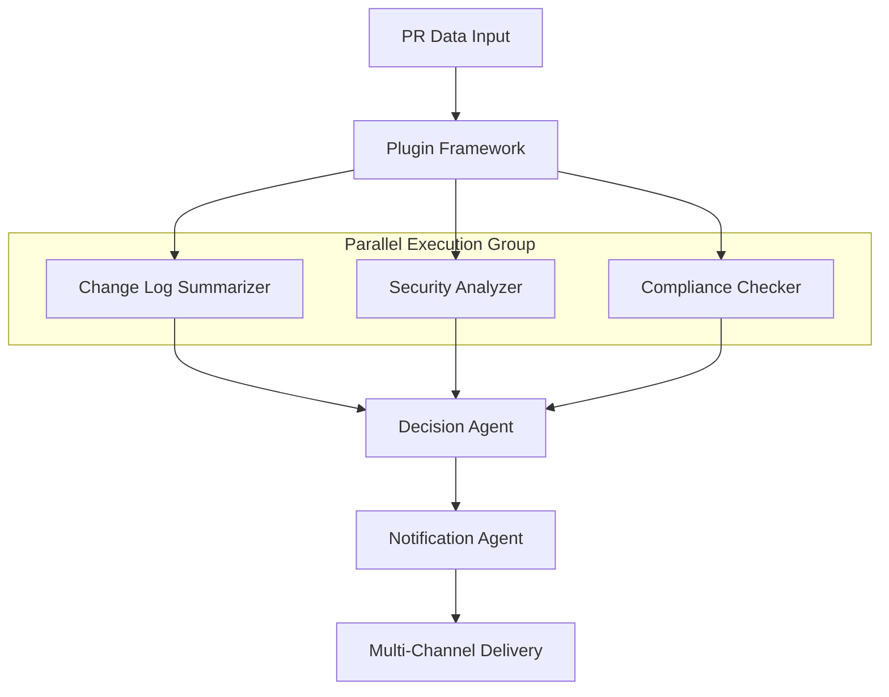

# Release Risk Analyzer - Plugin-Based Framework

A sophisticated, modular framework for analyzing pull request risks using intelligent agent plugins. The system employs a configuration-driven architecture that makes adding new analysis capabilities simple and scalable.

## 🚀 Quick Start

### Run the Demo
```bash
cd src
python simple_demo.py
```

This demonstrates the complete plugin-based workflow with simulated analysis results.

### Basic Usage
```python
# Example configuration-driven analysis
from plugin_framework import WorkflowOrchestrator, AgentPluginRegistry, ConfigurationManager

# Load configuration
config_manager = ConfigurationManager("config/basic_config.yaml")
await config_manager.load_config()

# Initialize framework
registry = AgentPluginRegistry()
orchestrator = WorkflowOrchestrator(registry, config_manager)

# Register plugins and run analysis
# Plugins automatically discovered from configuration
```

## 🏗️ Architecture Overview

### Plugin-Based Design

The framework uses a modular plugin architecture where each analysis capability is implemented as an independent plugin:

```
📦 Release Risk Analyzer
├── 🔌 Plugin Framework (Core)
│   ├── BaseAgentPlugin (Interface)
│   ├── AgentPluginRegistry (Management)
│   ├── ConfigurationManager (Config)
│   └── WorkflowOrchestrator (Execution)
├── 🧩 Built-in Plugins
│   ├── ChangeLogSummarizerPlugin
│   ├── SecurityAnalyzerPlugin
│   ├── ComplianceCheckerPlugin
│   └── NotificationAgentPlugin
├── ⚙️ Configuration System
│   ├── basic_config.yaml
│   ├── enterprise_config.yaml
│   └── development_config.yaml
└── 🔧 Custom Plugins (User-defined)
```

### Key Benefits

- **🔌 Modular**: Each analysis is a separate, testable plugin
- **⚙️ Configurable**: Enable/disable features through YAML configuration
- **🔄 Hot-Reload**: Configuration changes applied without restart
- **📊 Scalable**: Plugins run in parallel where possible
- **🔧 Extensible**: Add new plugins without modifying core framework
- **🎯 Focused**: Each plugin has single responsibility

## 🧩 Built-in Plugins

### 1. Change Log Summarizer Plugin
- **Purpose**: Intelligent analysis of PR changes using LLM
- **Capabilities**: Change summarization, module detection, risk assessment
- **LLM Integration**: Primary analysis with heuristic fallback

### 2. Security Analyzer Plugin  
- **Purpose**: Comprehensive security analysis
- **Scans**: Secret detection, vulnerability scanning, dependency analysis
- **Scoring**: Risk-based security scoring with recommendations

### 3. Compliance Checker Plugin
- **Purpose**: Regulatory compliance validation
- **Standards**: SOX, GDPR, HIPAA, PCI DSS, custom rules
- **Validation**: File-based and content-based compliance checking

### 4. Notification Agent Plugin
- **Purpose**: Multi-channel result delivery
- **Channels**: Slack, Email, Webhook, Microsoft Teams, Jira
- **Templating**: Customizable notification templates

## ⚙️ Configuration System

### Simple Configuration
```yaml
# config/basic_config.yaml
workflow:
  name: "basic_risk_analysis"
  execution_mode: "sequential_with_parallel"

plugins:
  change_log_summarizer:
    enabled: true
    config:
      llm_provider: "openai"
      confidence_threshold: 0.7

  security_analyzer:
    enabled: true
    config:
      scan_types: ["secret_detection", "vulnerability_scan"]

  notification_agent:
    enabled: true
    config:
      channels: ["slack", "email"]
```

### Enterprise Configuration
```yaml
# config/enterprise_config.yaml - Full feature set
workflow:
  name: "enterprise_risk_analysis"
  execution_mode: "hybrid"
  retry_policy:
    max_retries: 3

plugins:
  # Enhanced security with multiple scan types
  security_analyzer:
    config:
      scan_types: ["secret_detection", "vulnerability_scan", "static_analysis"]
      custom_patterns:
        api_keys: "(api_key|apikey).*"
        
  # Comprehensive compliance
  custom_compliance_checker:
    config:
      standards: ["SOX", "GDPR", "HIPAA", "PCI_DSS"]
      custom_rules:
        financial_review:
          required_approvers: ["finance_team", "compliance_officer"]
          
  # Multi-channel notifications
  notification_agent:
    config:
      channels: ["slack", "email", "teams", "jira"]
      notification_rules:
        high_risk: ["slack", "email", "jira"]
        compliance_violation: ["email", "teams"]

global_config:
  enable_metrics: true
  tracing_enabled: true
  cache_enabled: true
```

## 🔧 Adding Custom Plugins

### Step 1: Create Plugin Class
```python
from plugin_framework import BaseAgentPlugin, AgentMetadata, AgentInput, AgentOutput

class CustomAnalysisPlugin(BaseAgentPlugin):
    def get_metadata(self) -> AgentMetadata:
        return AgentMetadata(
            name="custom_analysis",
            version="1.0.0",
            description="Custom business rules analysis",
            capabilities=[AgentCapability.ANALYSIS],
            execution_priority=30
        )
    
    async def process(self, input_data: AgentInput, state) -> AgentOutput:
        # Your custom analysis logic
        result = await self.analyze_business_rules(input_data.data)
        
        return AgentOutput(
            result=result,
            confidence=0.9,
            session_id=input_data.session_id
        )
```

### Step 2: Add Configuration
```yaml
plugins:
  custom_analysis:
    enabled: true
    config:
      business_rules_db: "postgresql://localhost/rules"
      validation_mode: "strict"
```

### Step 3: Plugin Auto-Discovery
The framework automatically discovers and loads configured plugins.

## 🔄 Execution Modes

### Sequential Execution
```yaml
workflow:
  execution_mode: "sequential"
# Plugins run one after another
```

### Parallel Execution
```yaml
workflow:
  execution_mode: "parallel"
# Compatible plugins run simultaneously
```

### Hybrid Execution (Recommended)
```yaml
workflow:
  execution_mode: "hybrid"
# Optimal mix of sequential and parallel execution
```

## 📊 Analysis Flow



## 🔍 LLM Integration

### Primary LLM Analysis
- **OpenAI GPT-4**: Advanced code analysis and risk assessment
- **Anthropic Claude**: Alternative LLM provider
- **Custom Prompts**: Tailored analysis instructions

### Fallback Strategy
```python
# Automatic fallback to heuristic analysis
if llm_confidence < threshold:
    result = await heuristic_analysis()
else:
    result = llm_analysis_result
```

## 📁 Project Structure

```
ReleaseRiskAnalyserAgent/
├── src/
│   ├── plugin_framework.py      # Core plugin framework
│   ├── example_plugins.py       # Built-in plugin implementations
│   ├── simple_demo.py          # Working demonstration
│   └── enhanced_models.py       # Data models
├── config/
│   ├── basic_config.yaml       # Simple configuration
│   ├── enterprise_config.yaml  # Full enterprise setup
│   └── development_config.yaml # Development environment
├── docs/
│   ├── Architecture.md         # Complete architecture documentation
│   ├── PLUGIN_FRAMEWORK_GUIDE.md # Plugin development guide
│   └── AGENT_SPECIFICATIONS.md # Agent specifications
└── README.md                   # This file
```

## 🚦 Getting Started

### 1. Clone Repository
```bash
git clone https://github.com/company/ReleaseRiskAnalyzerAgent.git
cd ReleaseRiskAnalyzerAgent
```

### 2. Install Dependencies
```bash
pip install -r requirements.txt
```

### 3. Configure Environment
```bash
export OPENAI_API_KEY="your-openai-key"
export SLACK_WEBHOOK_URL="your-slack-webhook"
```

### 4. Run Demo
```bash
cd src
python simple_demo.py
```

### 5. Customize Configuration
Edit `config/basic_config.yaml` to enable/disable plugins and modify settings.

## 📚 Documentation

- **[Architecture.md](Architecture.md)** - Complete system architecture with diagrams
- **[PLUGIN_FRAMEWORK_GUIDE.md](PLUGIN_FRAMEWORK_GUIDE.md)** - Plugin development guide
- **[AGENT_SPECIFICATIONS.md](AGENT_SPECIFICATIONS.md)** - Detailed agent specifications
- **[LLM_INTEGRATION_SUMMARY.md](LLM_INTEGRATION_SUMMARY.md)** - LLM integration details

## 🔧 Configuration Examples

### Development Environment
```yaml
# Minimal setup for testing
workflow:
  execution_mode: "sequential"
plugins:
  change_log_summarizer:
    enabled: true
    config:
      llm_provider: "mock"  # Use mock for testing
global_config:
  log_level: "DEBUG"
  hot_reload: true
```

### Production Environment
```yaml
# Full enterprise setup
workflow:
  execution_mode: "hybrid"
  timeout_seconds: 600
  retry_policy:
    max_retries: 3
plugins:
  # All plugins enabled with full configuration
global_config:
  enable_metrics: true
  tracing_enabled: true
  cache_enabled: true
```

## 🎯 Use Cases

### 1. Basic Release Validation
- Change analysis and security scanning
- Simple approval workflow
- Slack/Email notifications

### 2. Enterprise Compliance
- SOX/GDPR/HIPAA validation
- Multi-stage approval process
- Audit trail and reporting

### 3. Custom Business Rules
- Industry-specific validations
- Custom compliance frameworks
- Integration with existing tools

### 4. Continuous Integration
- Automated PR analysis
- Git webhook integration
- CI/CD pipeline integration

## 🔮 Extensibility

### Plugin Categories
- **Analysis Plugins**: Code analysis, metrics, complexity
- **Security Plugins**: Vulnerability scanning, secret detection  
- **Compliance Plugins**: Regulatory validation, policy checking
- **Integration Plugins**: External system integration
- **Notification Plugins**: Multi-channel communication

### Custom Plugin Types
```python
# Analysis Plugin
class CodeQualityPlugin(BaseAgentPlugin):
    capabilities = [AgentCapability.ANALYSIS]

# Security Plugin  
class CustomSecurityPlugin(BaseAgentPlugin):
    capabilities = [AgentCapability.SECURITY]

# Integration Plugin
class JiraIntegrationPlugin(BaseAgentPlugin):
    capabilities = [AgentCapability.INTEGRATION]
```

## 📈 Performance & Scalability

### Parallel Execution
- Compatible plugins run simultaneously
- Configurable parallelism limits
- Dependency-aware scheduling

### Caching & Performance
```yaml
global_config:
  cache_enabled: true
  cache_backend: "redis"
  max_parallel_agents: 5
```

### Monitoring & Observability
```yaml
global_config:
  enable_metrics: true
  tracing_enabled: true
  metrics_endpoint: "http://prometheus:9090"
```

## 🤝 Contributing

1. **Fork the Repository**
2. **Create Feature Branch**: `git checkout -b feature/new-plugin`
3. **Implement Plugin**: Follow plugin development guide
4. **Add Tests**: Include unit and integration tests
5. **Update Documentation**: Document configuration options
6. **Submit Pull Request**: Include description of functionality

## 📝 License

This project is licensed under the MIT License - see the LICENSE file for details.

## 🙋‍♂️ Support

- **Documentation**: Check the `docs/` directory for detailed guides
- **Examples**: Review `src/example_plugins.py` for implementation patterns
- **Configuration**: Try different config files for various scenarios
- **Issues**: Open GitHub issues for bugs or feature requests

---

**Built with ❤️ using a modular, plugin-based architecture for maximum flexibility and extensibility.**