# Risk Agent Analyzer - Architecture Documentation

## Executive Summary

The Risk Agent Analyzer is a professional-grade multi-repository analysis framework that provides comprehensive code review and risk assessment through specialized agents. The system has evolved from a monolithic structure into a clean, modular architecture supporting enterprise-scale analysis with LLM integration and comprehensive reporting.

### Key Capabilities
- Multi-repository analysis with parallel processing
- Modular agent system for different technologies (Python, Java, JavaScript, SQL)
- Enterprise LLM integration (Walmart LLM Gateway)
- Comprehensive reporting with Good/OK/Bad classification
- GitHub Enterprise support
- Configurable analysis modes (full repository vs PR-only)
- Professional package structure for maintainability

---

## 1. Current Modular Architecture

### 1.1 Package Structure

```
RiskAgentAnalyzer/
├── risk_analyzer.py           # Main executable entry point
├── setup.py                  # Package configuration
├── requirements.txt          # Dependencies
├── .env                      # Environment configuration
└── src/                      # Core package modules
    ├── agents/               # Code review agents
    │   ├── __init__.py
    │   └── code_review_agents.py
    ├── analysis/             # Analysis orchestration
    │   ├── __init__.py
    │   ├── code_review_orchestrator.py
    │   ├── pr_analyzer.py
    │   └── risk_assessor.py
    ├── integration/          # External integrations
    │   ├── __init__.py
    │   ├── llm_client.py
    │   ├── git_integration.py
    │   └── environment_config.py
    ├── orchestration/        # Workflow management
    │   ├── __init__.py
    │   ├── repository_orchestrator.py
    │   └── workflow_manager.py
    ├── reporting/            # Report generation
    │   ├── __init__.py
    │   ├── comprehensive_reporter.py
    │   ├── summary_generator.py
    │   └── report_formatter.py
    └── utilities/            # Common utilities
        ├── __init__.py
        ├── data_structures.py
        ├── formatting_utils.py
        └── config_utils.py
```

### 1.2 Architectural Layers

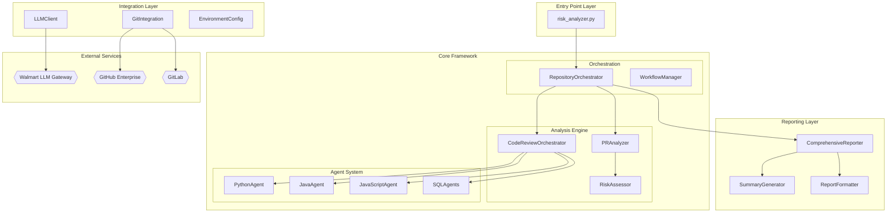

## 2. Component Details

### 2.1 Package Responsibilities

#### `src/agents/` - Code Review Agent System
- **Purpose**: Specialized analysis agents for different technologies
- **Key Components**:
  - `PythonCodeReviewAgent`: Python code quality, security, complexity analysis
  - `JavaCodeReviewAgent`: Java enterprise patterns and security
  - `JavaScriptCodeReviewAgent`: Modern JS practices and vulnerabilities
  - `ReactJSCodeReviewAgent`: Component architecture and performance
  - Database agents: BigQuery, Azure SQL, PostgreSQL, Cosmos DB
- **Design**: Simplified base classes replacing complex plugin framework
- **LLM Integration**: Direct integration with LLM client for analysis

#### `src/analysis/` - Analysis Orchestration
- **Purpose**: Coordinates analysis workflow and agent execution
- **Key Components**:
  - `CodeReviewOrchestrator`: Manages parallel agent execution
  - `PRAnalyzer`: Pull request specific analysis logic
  - `RiskAssessor`: Risk scoring and classification algorithms
- **Features**: Supports both full repository and PR-only analysis modes
- **Parallelization**: Asyncio-based concurrent agent execution

#### `src/integration/` - External System Integration
- **Purpose**: Manages all external service connections
- **Key Components**:
  - `LLMClient`: Walmart LLM Gateway integration with authentication
  - `GitIntegration`: GitHub Enterprise and standard Git operations
  - `EnvironmentConfig`: Configuration management and validation
- **Security**: Proper credential handling and API authentication
- **Extensibility**: Plugin architecture for additional providers

#### `src/orchestration/` - Workflow Management
- **Purpose**: High-level workflow coordination and repository management
- **Key Components**:
  - `RepositoryOrchestrator`: Multi-repository analysis coordination
  - `WorkflowManager`: Analysis workflow execution and tracking
- **Features**: Progress tracking, error handling, resource management
- **Scalability**: Designed for enterprise-scale multi-repository analysis

#### `src/reporting/` - Report Generation
- **Purpose**: Comprehensive report creation with professional formatting
- **Key Components**:
  - `ComprehensiveReporter`: 5-section detailed reports
  - `SummaryGenerator`: AI-powered executive summaries
  - `ReportFormatter`: Professional formatting and classification
- **Features**: Good/OK/Bad classification, risk metrics, actionable insights
- **Output**: Timestamped reports with detailed technical findings

#### `src/utilities/` - Common Infrastructure
- **Purpose**: Shared data structures and utility functions
- **Key Components**:
  - `DataStructures`: Type-safe classes for analysis results
  - `FormattingUtils`: Professional output formatting functions
  - `ConfigUtils`: Configuration loading and validation
- **Design**: Type hints, enums, professional error handling
- **Maintainability**: Centralized common functionality

### 2.2 Data Flow Architecture

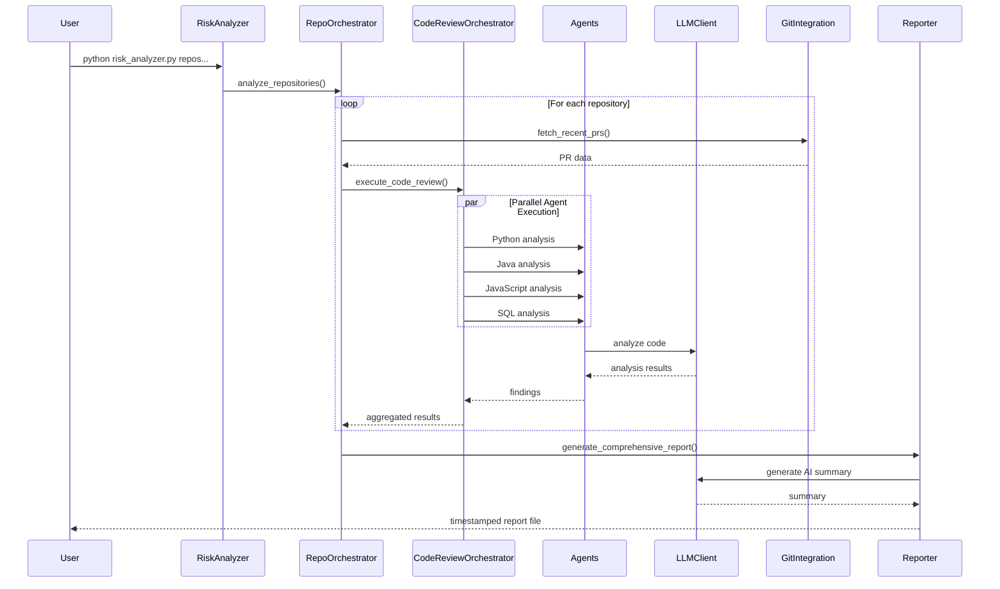

## 3. Alternative Architecture Proposals

### 3.1 Microservices Architecture

**Current State**: Monolithic modular application
**Proposal**: Decompose into containerized microservices

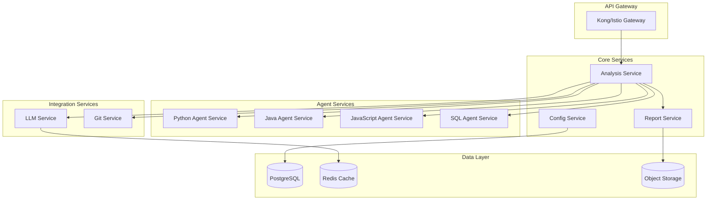

**Benefits**:
- Independent scaling of agent services
- Technology diversity (different languages per service)
- Fault isolation and resilience
- Independent deployment cycles

**Drawbacks**:
- Increased operational complexity
- Network latency between services
- Distributed system challenges
- Higher infrastructure costs

### 3.2 Event-Driven Architecture

**Current State**: Synchronous orchestration
**Proposal**: Asynchronous event-driven workflow

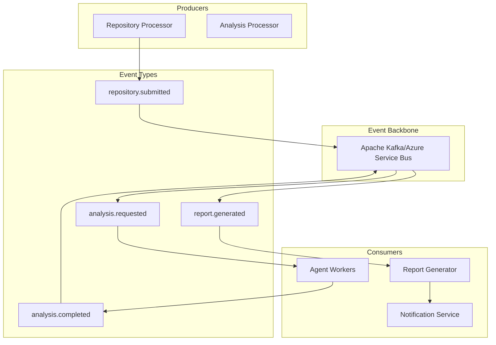

**Benefits**:
- Better scalability and throughput
- Loose coupling between components
- Natural support for parallel processing
- Audit trail through event log

**Drawbacks**:
- Eventual consistency challenges
- Complex debugging and monitoring
- Event schema evolution complexity
- Additional infrastructure dependencies

### 3.3 Plugin-Based Architecture

**Current State**: Fixed agent set in packages
**Proposal**: Dynamic plugin loading system

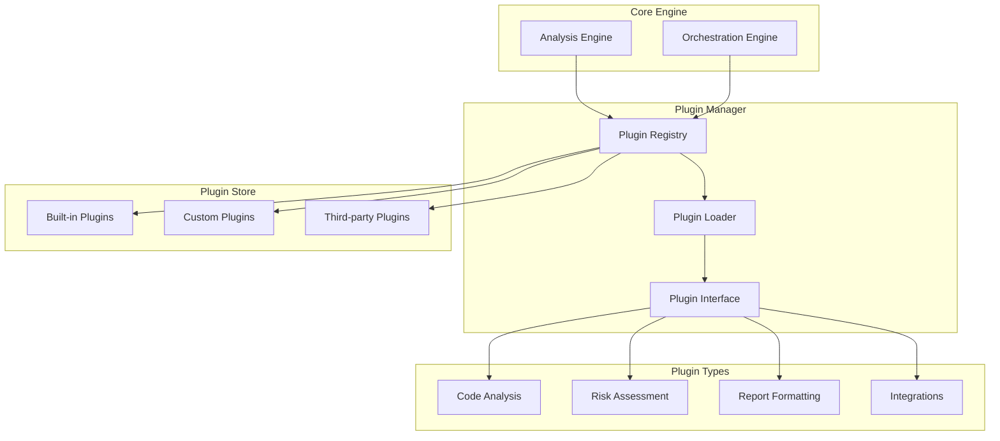

**Benefits**:
- Extensibility without core changes
- Community-driven plugin ecosystem
- Dynamic capability addition
- Version management per plugin

**Drawbacks**:
- Plugin compatibility management
- Security and sandboxing challenges
- Performance overhead
- Complex dependency resolution

### 3.4 Serverless Architecture

**Current State**: Long-running Python application
**Proposal**: Function-based serverless deployment

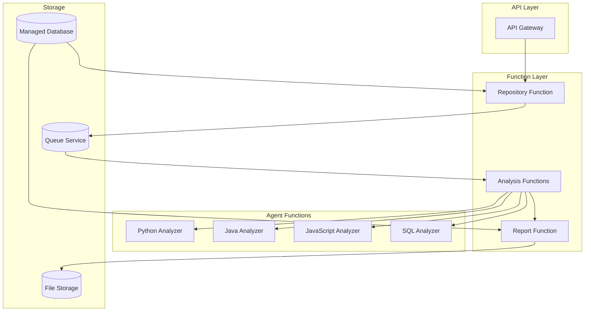

**Benefits**:
- Zero server management overhead
- Automatic scaling based on demand
- Cost efficiency (pay per execution)
- High availability and fault tolerance

**Drawbacks**:
- Cold start latency issues
- Function timeout limitations
- Vendor lock-in concerns
- Limited control over execution environment

## 4. Recommended Evolution Path

### Phase 1: Current Modular Optimization (Immediate)
- ✅ **Completed**: Clean modular package structure
- **Next**: Performance optimization and caching
- **Next**: Enhanced error handling and logging
- **Next**: Comprehensive test suite implementation

### Phase 2: Enhanced Integration (3-6 months)
- **Plugin System**: Implement dynamic agent loading
- **Caching Layer**: Redis/SQLite for analysis results
- **Database Support**: Persistent storage for large-scale analysis
- **API Layer**: REST API for programmatic access

### Phase 3: Scale Preparation (6-12 months)
- **Containerization**: Docker deployment support
- **Kubernetes**: Orchestrated deployment option
- **Event Streaming**: Kafka integration for high-volume processing
- **Monitoring**: Comprehensive observability stack

### Phase 4: Enterprise Features (12+ months)
- **Multi-tenancy**: Organization-based isolation
- **Advanced Analytics**: Trend analysis and ML insights
- **Integration Hub**: Multiple LLM providers and VCS systems
- **Governance Dashboard**: Management interface for policies

## 5. Implementation Recommendations

### 5.1 Immediate Priorities
1. **Performance Optimization**: Implement caching for repeated analyses
2. **Error Resilience**: Enhanced error handling and retry mechanisms  
3. **Configuration Management**: Centralized configuration validation
4. **Testing Strategy**: Unit and integration test coverage
5. **Documentation**: API documentation and developer guides

### 5.2 Architecture Decision Records (ADRs)

#### ADR-001: Modular Package Structure
- **Decision**: Adopt package-based modular architecture
- **Rationale**: Maintainability, testability, clear separation of concerns
- **Status**: ✅ Implemented

#### ADR-002: Synchronous Orchestration
- **Decision**: Use asyncio for concurrent agent execution within synchronous workflow
- **Rationale**: Simplicity, deterministic execution, easier debugging
- **Status**: ✅ Implemented
- **Future**: Consider event-driven for scale requirements

#### ADR-003: Simplified Agent Framework
- **Decision**: Replace complex plugin framework with simple base classes
- **Rationale**: Reduced complexity, easier maintenance, better performance
- **Status**: ✅ Implemented

#### ADR-004: Direct LLM Integration
- **Decision**: Direct integration with Walmart LLM Gateway
- **Rationale**: Enterprise requirements, authentication, performance
- **Status**: ✅ Implemented
- **Future**: Add multi-provider support for flexibility

### 5.3 Quality Metrics

```yaml
Code Quality Targets:
  Test Coverage: ">= 80%"
  Cyclomatic Complexity: "<= 10 per function"
  Type Coverage: ">= 90%"
  Documentation: "All public APIs documented"

Performance Targets:
  Single Repository Analysis: "< 2 minutes"
  Multi-Repository (10 repos): "< 15 minutes"
  Memory Usage: "< 1GB per analysis"
  Concurrent Agents: "8+ agents in parallel"

Reliability Targets:
  Uptime: ">= 99.5%"
  Error Rate: "< 0.1%"
  Recovery Time: "< 30 seconds"
  Data Consistency: "100%"
```
    
    %% Styling
    classDef frontend fill:#e3f2fd
    classDef orchestration fill:#fff3e0
    classDef agent fill:#e8f5e8
    classDef data fill:#fce4ec
    classDef external fill:#f3e5f5
    
    class WUI,API frontend
    class WFE,SM,PR orchestration
    class IV,CA,PE,RA,DE,QA,CR agent
    class CS,AC,AL data
    class GP,LLM,NS external
```

---

## 2. Component Architecture

### 2.1 Workflow Orchestration Layer

The system employs LangGraph for state-based workflow orchestration, providing:

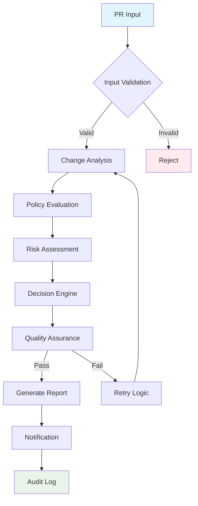

#### Core Components:

**Workflow Engine (`src/workflow.py`)**
- Implements LangGraph StateGraph for agent orchestration
- Manages workflow state transitions and error handling
- Provides conditional routing and retry mechanisms

**State Manager (`src/enhanced_models.py`)**
- Maintains workflow state using Pydantic models
- Ensures data consistency across agent transitions
- Implements type safety and validation

### 2.2 Agent Layer Architecture

The multi-agent system follows the Agent pattern with specialized responsibilities:

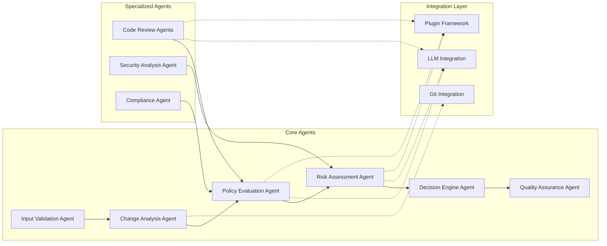

#### Agent Responsibilities:

1. **Input Validation Agent** - Validates PR data structure and completeness
2. **Change Analysis Agent** - Analyzes code changes and extract metadata
3. **Policy Evaluation Agent** - Evaluates governance policies and compliance
4. **Risk Assessment Agent** - Calculates comprehensive risk scores
5. **Decision Engine Agent** - Makes final Go/No-Go decisions
6. **Quality Assurance Agent** - Validates analysis quality and consistency

### 2.3 Plugin Framework

The extensible plugin architecture enables custom analysis capabilities:

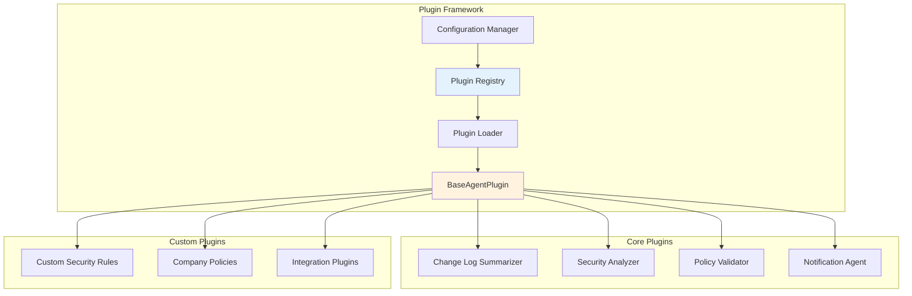

---

## 3. Data Flow Architecture

### 3.1 Request Processing Flow

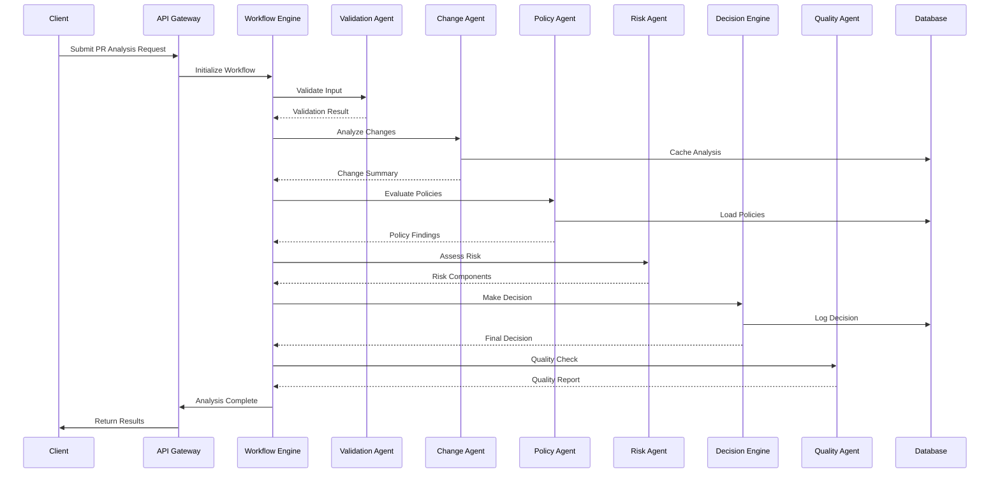

### 3.2 Configuration Management Flow

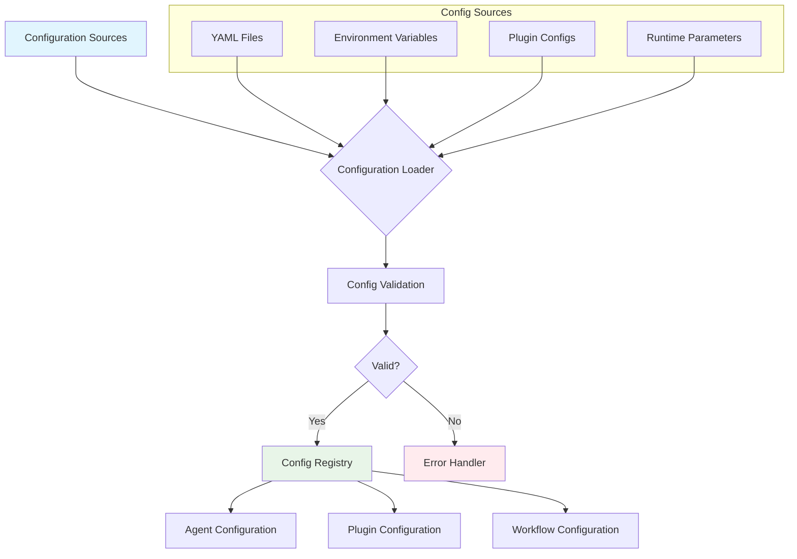

---

## 4. Technology Stack

### 4.1 Core Technologies

| Layer | Technology | Version | Rationale |
|-------|------------|---------|-----------|
| **Orchestration** | LangGraph | Latest | State-based agent workflow management |
| **Language** | Python | 3.8+ | Ecosystem maturity, ML/AI libraries |
| **Data Validation** | Pydantic | 2.x | Type safety, data validation |
| **Configuration** | PyYAML | Latest | Human-readable configuration |
| **Git Integration** | GitPython | Latest | Native Git operations |
| **HTTP** | Requests | Latest | External API integration |
| **Logging** | Python logging | Standard | Observability |

### 4.2 External Dependencies

| Service | Purpose | Integration Method |
|---------|---------|-------------------|
| **LLM Providers** | AI-powered analysis | REST API (OpenAI, Anthropic, etc.) |
| **Git Providers** | Source code access | REST API (GitHub, GitLab, etc.) |
| **Notification** | Alerts and reporting | Webhooks (Slack, Teams, etc.) |
| **Storage** | Configuration and cache | File system or cloud storage |

---

## 5. Deployment Architecture

### 5.1 Deployment Models

#### Standalone Deployment
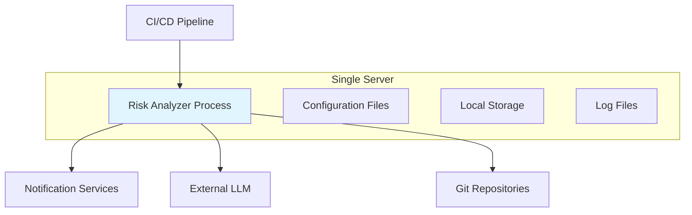

#### Container Deployment
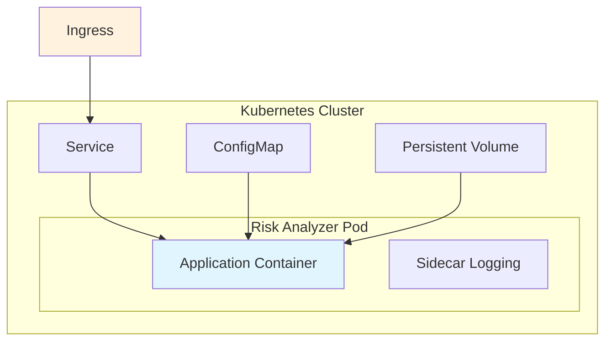

#### Serverless Deployment
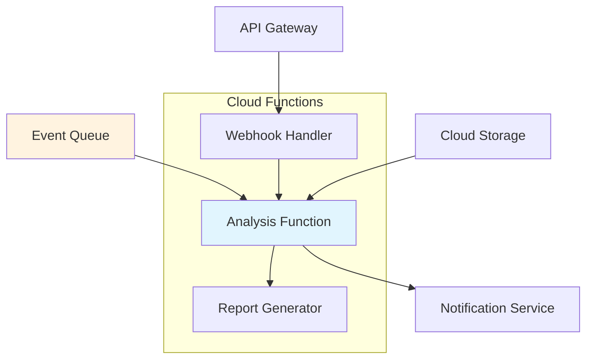

### 5.2 Scaling Considerations

**Horizontal Scaling**
- Stateless agent design enables multiple instances
- Shared configuration and cache storage
- Load balancing across analyzer instances

**Vertical Scaling**
- LLM processing can be CPU/memory intensive
- Concurrent agent execution within workflow
- Configurable timeout and resource limits

---

## 6. Security Architecture

### 6.1 Security Controls

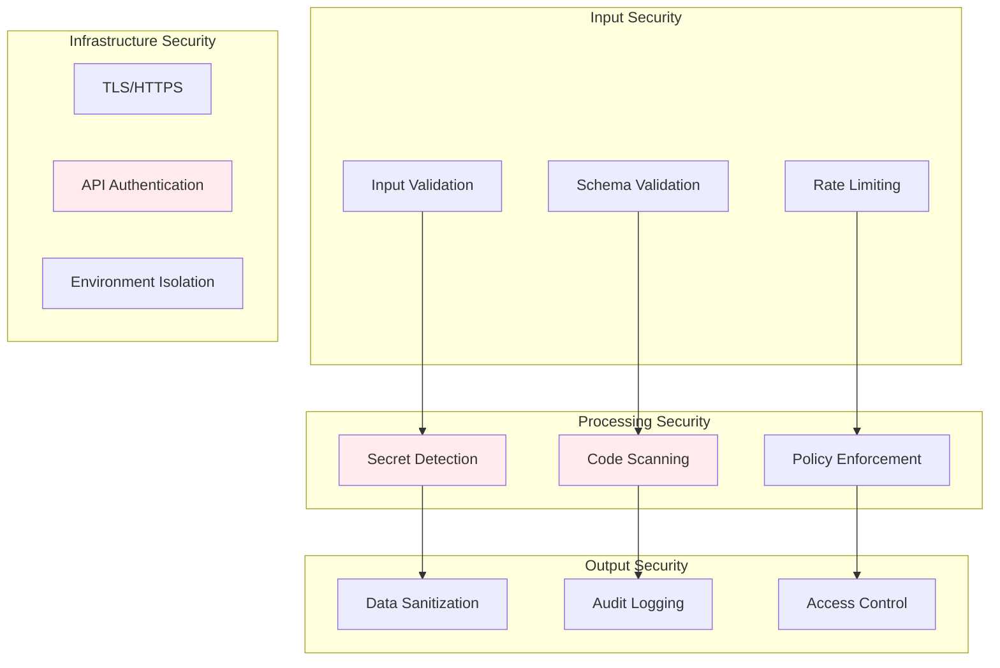

### 6.2 Data Protection

**Sensitive Data Handling**
- API keys and tokens secured via environment variables
- No persistent storage of sensitive PR content
- Configurable data retention policies
- Audit trail for all analysis decisions

**Access Controls**
- Role-based configuration access
- Plugin execution sandboxing
- Network-level restrictions for external services

---

## 7. Integration Patterns

### 7.1 CI/CD Integration

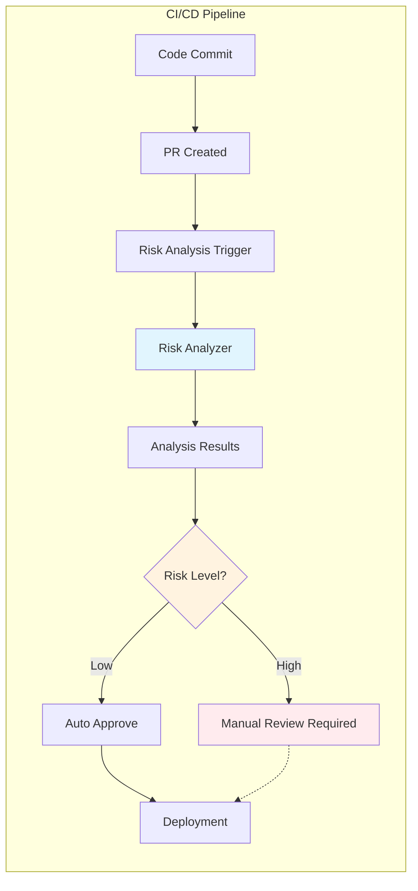

### 7.2 External Service Integration

**Git Provider Integration**
- Webhook-based PR event handling
- REST API for repository metadata
- Branch and commit analysis
- Diff processing and file change detection

**LLM Provider Integration**
- Multi-provider support (OpenAI, Anthropic, etc.)
- Fallback mechanisms for provider availability
- Rate limiting and cost management
- Response validation and error handling

**Notification Integration**
- Multi-channel support (Slack, Teams, Email)
- Template-based message formatting
- Escalation and routing rules
- Delivery confirmation and retry logic

---

## 8. Alternative Architectures

### 8.1 Event-Driven Architecture

**Benefits:**
- Improved scalability and responsiveness
- Better fault isolation
- Asynchronous processing capabilities

**Implementation:**
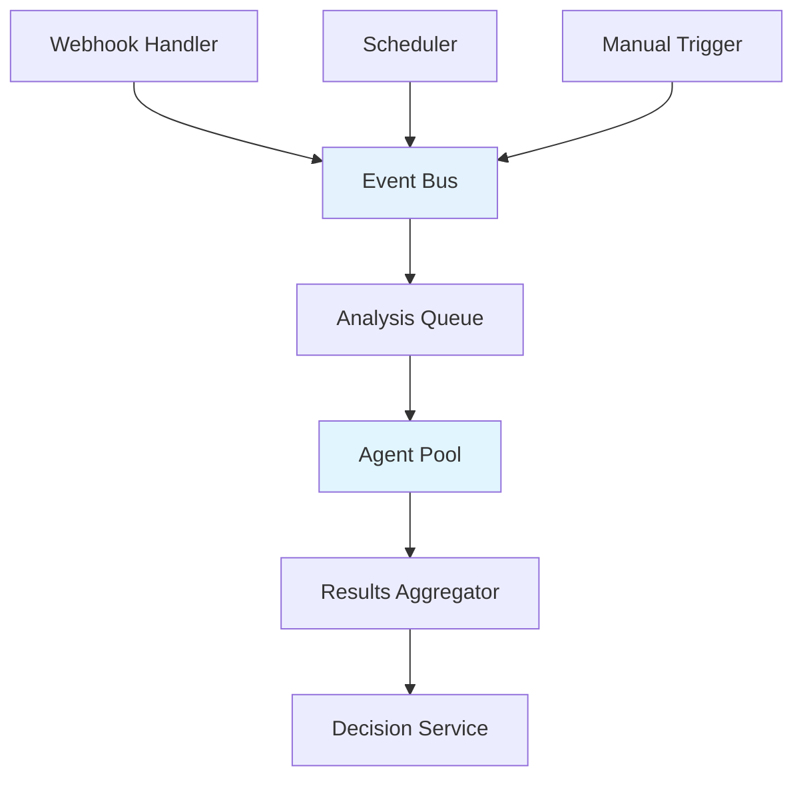

**Considerations:**
- Increased complexity
- Additional infrastructure requirements
- Eventual consistency challenges

### 8.2 Microservices Architecture

**Benefits:**
- Independent deployment and scaling
- Technology diversity
- Team autonomy

**Implementation:**
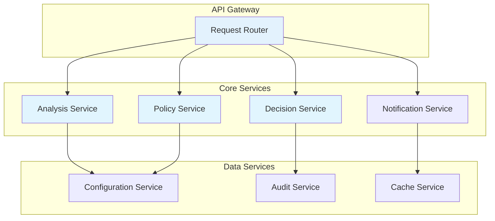

**Considerations:**
- Operational overhead
- Network latency
- Distributed system complexity

### 8.3 Serverless Architecture

**Benefits:**
- Auto-scaling
- Pay-per-use pricing
- Reduced operational overhead

**Implementation:**
- Function-per-agent deployment
- Event-driven triggering
- Managed storage and messaging

**Considerations:**
- Cold start latency
- Vendor lock-in
- Limited execution time

---

## 9. Non-Functional Requirements

### 9.1 Performance Requirements

| Metric | Target | Rationale |
|--------|--------|-----------|
| **Analysis Latency** | < 30 seconds | CI/CD pipeline integration |
| **Throughput** | 100 PRs/hour | Enterprise workload support |
| **Concurrent Analysis** | 10 parallel | Resource optimization |
| **LLM Response Time** | < 5 seconds | User experience |
| **Memory Usage** | < 2GB per instance | Cost efficiency |

### 9.2 Reliability Requirements

| Metric | Target | Implementation |
|--------|--------|---------------|
| **Availability** | 99.5% | Health checks, auto-restart |
| **Error Rate** | < 1% | Robust error handling |
| **Recovery Time** | < 2 minutes | Quick restart mechanisms |
| **Data Durability** | 99.9% | Persistent audit logs |

### 9.3 Scalability Requirements

**Vertical Scaling:**
- Support for 4-16 CPU cores
- Memory scaling from 2GB to 32GB
- GPU support for enhanced LLM processing

**Horizontal Scaling:**
- Stateless design for multiple instances
- Shared configuration and cache
- Load balancing support

### 9.4 Security Requirements

| Requirement | Implementation |
|-------------|---------------|
| **Authentication** | API key or OAuth integration |
| **Authorization** | Role-based access control |
| **Data Encryption** | TLS 1.3 for transit, AES-256 for rest |
| **Audit Logging** | Comprehensive activity logging |
| **Secret Management** | Environment variables, vault integration |
| **Input Validation** | Schema validation, sanitization |

### 9.5 Maintainability Requirements

**Code Quality:**
- Test coverage > 80%
- Linting and formatting standards
- Documentation completeness

**Monitoring:**
- Application metrics
- Performance monitoring
- Error tracking and alerting

**Deployment:**
- Infrastructure as Code
- Automated deployment pipelines
- Environment parity

### 9.6 Usability Requirements

**Configuration Management:**
- YAML-based configuration
- Environment-specific overrides
- Runtime configuration updates

**Observability:**
- Structured logging
- Metrics and dashboards
- Distributed tracing

**Developer Experience:**
- Clear API documentation
- SDK and client libraries
- Plugin development guides

---

## 10. Reference Architectures

### 10.1 Clean Architecture Principles

The system follows Clean Architecture patterns:

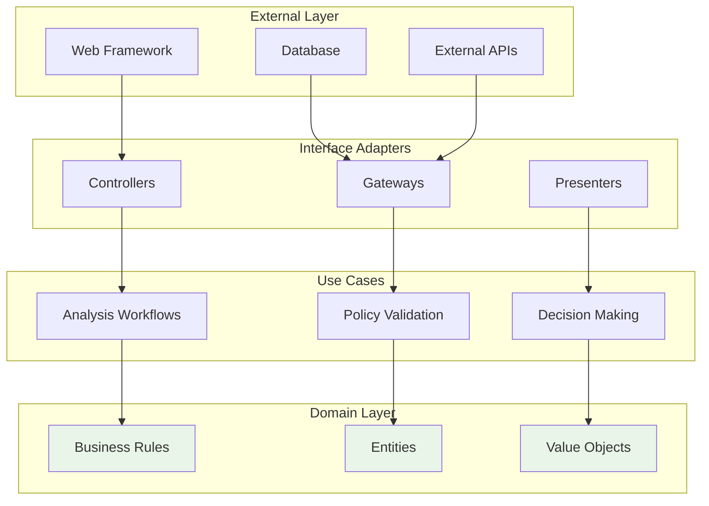

### 10.2 Domain-Driven Design

**Bounded Contexts:**
- Risk Analysis Domain
- Policy Management Domain
- Workflow Orchestration Domain
- Integration Domain

**Aggregates:**
- PR Analysis Aggregate
- Policy Configuration Aggregate
- Workflow State Aggregate

### 10.3 CQRS Pattern

Command Query Responsibility Segregation for complex analysis workflows:

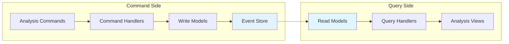

---

## 11. Technology Alternatives

### 11.1 Orchestration Alternatives

| Technology | Pros | Cons | Use Case |
|------------|------|------|---------|
| **LangGraph** | State management, Agent support | Python-only | AI/ML workflows |
| **Apache Airflow** | Mature, Web UI | Complex setup | Data pipelines |
| **Temporal** | Reliability, Language support | Resource intensive | Critical workflows |
| **Celery** | Simple, Redis/RabbitMQ | Limited state management | Task queues |

### 11.2 Storage Alternatives

| Technology | Pros | Cons | Use Case |
|------------|------|------|---------|
| **File System** | Simple, No setup | Limited scalability | Development |
| **Redis** | Fast, In-memory | Volatile | Caching |
| **PostgreSQL** | ACID, Rich queries | Setup overhead | Production |
| **MongoDB** | Document store, Flexible schema | Consistency trade-offs | Rapid development |

### 11.3 LLM Integration Alternatives

| Provider | Pros | Cons | Considerations |
|----------|------|------|---------------|
| **OpenAI** | High quality, Good APIs | Cost, Rate limits | Commercial use |
| **Anthropic** | Safety focused, Large context | Limited availability | Enterprise |
| **Local Models** | Privacy, No API costs | Resource intensive | On-premise |
| **Hugging Face** | Open source, Community | Variable quality | Experimentation |

---

## 12. Conclusion

The Risk Agent Analyzer employs a sophisticated multi-agent architecture that balances flexibility, scalability, and maintainability. The system's modular design enables incremental adoption and customization while maintaining enterprise-grade reliability and security.

### Key Architectural Benefits

1. **Modularity** - Plugin-based architecture enables custom analysis capabilities
2. **Scalability** - Stateless design supports horizontal scaling
3. **Reliability** - Comprehensive error handling and retry mechanisms
4. **Observability** - Built-in monitoring and audit capabilities
5. **Security** - Multiple layers of security controls and data protection
6. **Extensibility** - Clear extension points for new agents and integrations

### Future Considerations

1. **Machine Learning Pipeline** - Enhanced model training and feedback loops
2. **Real-time Processing** - Stream processing for immediate risk assessment
3. **Advanced Analytics** - Trend analysis and predictive capabilities
4. **Multi-tenant Support** - Organization isolation and customization
5. **Edge Computing** - Distributed analysis for reduced latency

The architecture provides a solid foundation for current requirements while enabling evolution to meet future needs in the rapidly changing landscape of software development and release management.