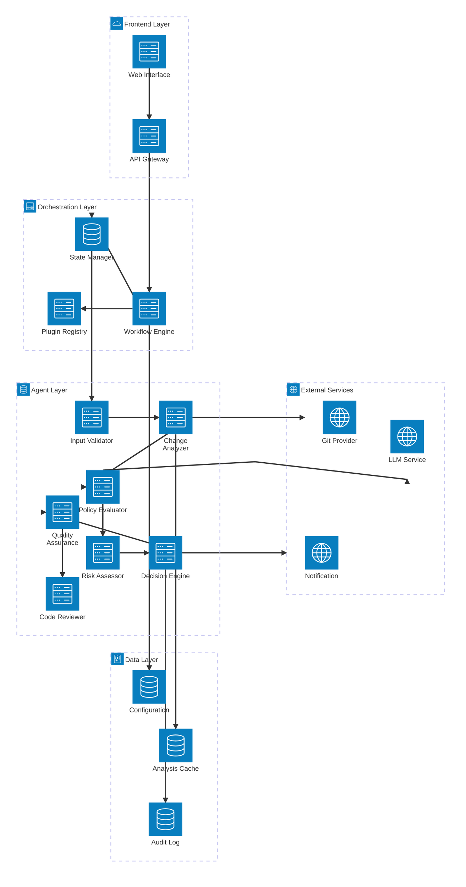

# Risk Agent Analyzer - Architecture Documentation

## Executive Summary

The Risk Agent Analyzer is an enterprise-grade CI/CD governance platform that provides automated release readiness assessment through multi-agent orchestration. The system leverages LLM-powered analysis agents, policy validation frameworks, and pluggable architecture to deliver comprehensive risk evaluation for software releases.

### Key Capabilities
- Automated pull request risk assessment
- Multi-agent workflow orchestration using LangGraph
- Extensible plugin framework for custom analysis
- Policy-driven governance enforcement
- Code quality and security analysis
- Real-time decision support with explainable AI

---

## 1. High-Level System Architecture

---

## 2. Component Architecture

### 2.1 Workflow Orchestration Layer

The system employs LangGraph for state-based workflow orchestration, providing:

#### Core Components:

**Workflow Engine (`src/workflow.py`)**
- Implements LangGraph StateGraph for agent orchestration
- Manages workflow state transitions and error handling
- Provides conditional routing and retry mechanisms

**State Manager (`src/enhanced_models.py`)**
- Maintains workflow state using Pydantic models
- Ensures data consistency across agent transitions
- Implements type safety and validation

### 2.2 Agent Layer Architecture

The multi-agent system follows the Agent pattern with specialized responsibilities:

#### Agent Responsibilities:

1. **Input Validation Agent** - Validates PR data structure and completeness
2. **Change Analysis Agent** - Analyzes code changes and extract metadata
3. **Policy Evaluation Agent** - Evaluates governance policies and compliance
4. **Risk Assessment Agent** - Calculates comprehensive risk scores
5. **Decision Engine Agent** - Makes final Go/No-Go decisions
6. **Quality Assurance Agent** - Validates analysis quality and consistency

### 2.3 Plugin Framework

The extensible plugin architecture enables custom analysis capabilities:

---

## 3. Data Flow Architecture

### 3.1 Request Processing Flow

### 3.2 Configuration Management Flow

---

## 4. Technology Stack

### 4.1 Core Technologies

| Layer | Technology | Version | Rationale |
|-------|------------|---------|-----------|
| **Orchestration** | LangGraph | Latest | State-based agent workflow management |
| **Language** | Python | 3.8+ | Ecosystem maturity, ML/AI libraries |
| **Data Validation** | Pydantic | 2.x | Type safety, data validation |
| **Configuration** | PyYAML | Latest | Human-readable configuration |
| **Git Integration** | GitPython | Latest | Native Git operations |
| **HTTP** | Requests | Latest | External API integration |
| **Logging** | Python logging | Standard | Observability |

### 4.2 External Dependencies

| Service | Purpose | Integration Method |
|---------|---------|-------------------|
| **LLM Providers** | AI-powered analysis | REST API (OpenAI, Anthropic, etc.) |
| **Git Providers** | Source code access | REST API (GitHub, GitLab, etc.) |
| **Notification** | Alerts and reporting | Webhooks (Slack, Teams, etc.) |
| **Storage** | Configuration and cache | File system or cloud storage |

---

## 5. Deployment Architecture

### 5.1 Deployment Models

#### Standalone Deployment

#### Container Deployment

#### Serverless Deployment

### 5.2 Scaling Considerations

**Horizontal Scaling**
- Stateless agent design enables multiple instances
- Shared configuration and cache storage
- Load balancing across analyzer instances

**Vertical Scaling**
- LLM processing can be CPU/memory intensive
- Concurrent agent execution within workflow
- Configurable timeout and resource limits

---

## 6. Security Architecture

### 6.1 Security Controls

### 6.2 Data Protection

**Sensitive Data Handling**
- API keys and tokens secured via environment variables
- No persistent storage of sensitive PR content
- Configurable data retention policies
- Audit trail for all analysis decisions

**Access Controls**
- Role-based configuration access
- Plugin execution sandboxing
- Network-level restrictions for external services

---

## 7. Integration Patterns

### 7.1 CI/CD Integration

### 7.2 External Service Integration

**Git Provider Integration**
- Webhook-based PR event handling
- REST API for repository metadata
- Branch and commit analysis
- Diff processing and file change detection

**LLM Provider Integration**
- Multi-provider support (OpenAI, Anthropic, etc.)
- Fallback mechanisms for provider availability
- Rate limiting and cost management
- Response validation and error handling

**Notification Integration**
- Multi-channel support (Slack, Teams, Email)
- Template-based message formatting
- Escalation and routing rules
- Delivery confirmation and retry logic

---

## 8. Alternative Architectures

### 8.1 Event-Driven Architecture

**Benefits:**
- Improved scalability and responsiveness
- Better fault isolation
- Asynchronous processing capabilities

**Implementation:**

**Considerations:**
- Increased complexity
- Additional infrastructure requirements
- Eventual consistency challenges

### 8.2 Microservices Architecture

**Benefits:**
- Independent deployment and scaling
- Technology diversity
- Team autonomy

**Implementation:**

**Considerations:**
- Operational overhead
- Network latency
- Distributed system complexity

### 8.3 Serverless Architecture

**Benefits:**
- Auto-scaling
- Pay-per-use pricing
- Reduced operational overhead

**Implementation:**
- Function-per-agent deployment
- Event-driven triggering
- Managed storage and messaging

**Considerations:**
- Cold start latency
- Vendor lock-in
- Limited execution time

---

## 9. Non-Functional Requirements

### 9.1 Performance Requirements

| Metric | Target | Rationale |
|--------|--------|-----------|
| **Analysis Latency** | < 30 seconds | CI/CD pipeline integration |
| **Throughput** | 100 PRs/hour | Enterprise workload support |
| **Concurrent Analysis** | 10 parallel | Resource optimization |
| **LLM Response Time** | < 5 seconds | User experience |
| **Memory Usage** | < 2GB per instance | Cost efficiency |

### 9.2 Reliability Requirements

| Metric | Target | Implementation |
|--------|--------|---------------|
| **Availability** | 99.5% | Health checks, auto-restart |
| **Error Rate** | < 1% | Robust error handling |
| **Recovery Time** | < 2 minutes | Quick restart mechanisms |
| **Data Durability** | 99.9% | Persistent audit logs |

### 9.3 Scalability Requirements

**Vertical Scaling:**
- Support for 4-16 CPU cores
- Memory scaling from 2GB to 32GB
- GPU support for enhanced LLM processing

**Horizontal Scaling:**
- Stateless design for multiple instances
- Shared configuration and cache
- Load balancing support

### 9.4 Security Requirements

| Requirement | Implementation |
|-------------|---------------|
| **Authentication** | API key or OAuth integration |
| **Authorization** | Role-based access control |
| **Data Encryption** | TLS 1.3 for transit, AES-256 for rest |
| **Audit Logging** | Comprehensive activity logging |
| **Secret Management** | Environment variables, vault integration |
| **Input Validation** | Schema validation, sanitization |

### 9.5 Maintainability Requirements

**Code Quality:**
- Test coverage > 80%
- Linting and formatting standards
- Documentation completeness

**Monitoring:**
- Application metrics
- Performance monitoring
- Error tracking and alerting

**Deployment:**
- Infrastructure as Code
- Automated deployment pipelines
- Environment parity

### 9.6 Usability Requirements

**Configuration Management:**
- YAML-based configuration
- Environment-specific overrides
- Runtime configuration updates

**Observability:**
- Structured logging
- Metrics and dashboards
- Distributed tracing

**Developer Experience:**
- Clear API documentation
- SDK and client libraries
- Plugin development guides

---

## 10. Reference Architectures

### 10.1 Clean Architecture Principles

The system follows Clean Architecture patterns:

### 10.2 Domain-Driven Design

**Bounded Contexts:**
- Risk Analysis Domain
- Policy Management Domain
- Workflow Orchestration Domain
- Integration Domain

**Aggregates:**
- PR Analysis Aggregate
- Policy Configuration Aggregate
- Workflow State Aggregate

### 10.3 CQRS Pattern

Command Query Responsibility Segregation for complex analysis workflows:

---

## 11. Technology Alternatives

### 11.1 Orchestration Alternatives

| Technology | Pros | Cons | Use Case |
|------------|------|------|---------|
| **LangGraph** | State management, Agent support | Python-only | AI/ML workflows |
| **Apache Airflow** | Mature, Web UI | Complex setup | Data pipelines |
| **Temporal** | Reliability, Language support | Resource intensive | Critical workflows |
| **Celery** | Simple, Redis/RabbitMQ | Limited state management | Task queues |

### 11.2 Storage Alternatives

| Technology | Pros | Cons | Use Case |
|------------|------|------|---------|
| **File System** | Simple, No setup | Limited scalability | Development |
| **Redis** | Fast, In-memory | Volatile | Caching |
| **PostgreSQL** | ACID, Rich queries | Setup overhead | Production |
| **MongoDB** | Document store, Flexible schema | Consistency trade-offs | Rapid development |

### 11.3 LLM Integration Alternatives

| Provider | Pros | Cons | Considerations |
|----------|------|------|---------------|
| **OpenAI** | High quality, Good APIs | Cost, Rate limits | Commercial use |
| **Anthropic** | Safety focused, Large context | Limited availability | Enterprise |
| **Local Models** | Privacy, No API costs | Resource intensive | On-premise |
| **Hugging Face** | Open source, Community | Variable quality | Experimentation |

---

## 12. Conclusion

The Risk Agent Analyzer employs a sophisticated multi-agent architecture that balances flexibility, scalability, and maintainability. The system's modular design enables incremental adoption and customization while maintaining enterprise-grade reliability and security.

### Key Architectural Benefits

1. **Modularity** - Plugin-based architecture enables custom analysis capabilities
2. **Scalability** - Stateless design supports horizontal scaling
3. **Reliability** - Comprehensive error handling and retry mechanisms
4. **Observability** - Built-in monitoring and audit capabilities
5. **Security** - Multiple layers of security controls and data protection
6. **Extensibility** - Clear extension points for new agents and integrations

### Future Considerations

1. **Machine Learning Pipeline** - Enhanced model training and feedback loops
2. **Real-time Processing** - Stream processing for immediate risk assessment
3. **Advanced Analytics** - Trend analysis and predictive capabilities
4. **Multi-tenant Support** - Organization isolation and customization
5. **Edge Computing** - Distributed analysis for reduced latency

The architecture provides a solid foundation for current requirements while enabling evolution to meet future needs in the rapidly changing landscape of software development and release management.